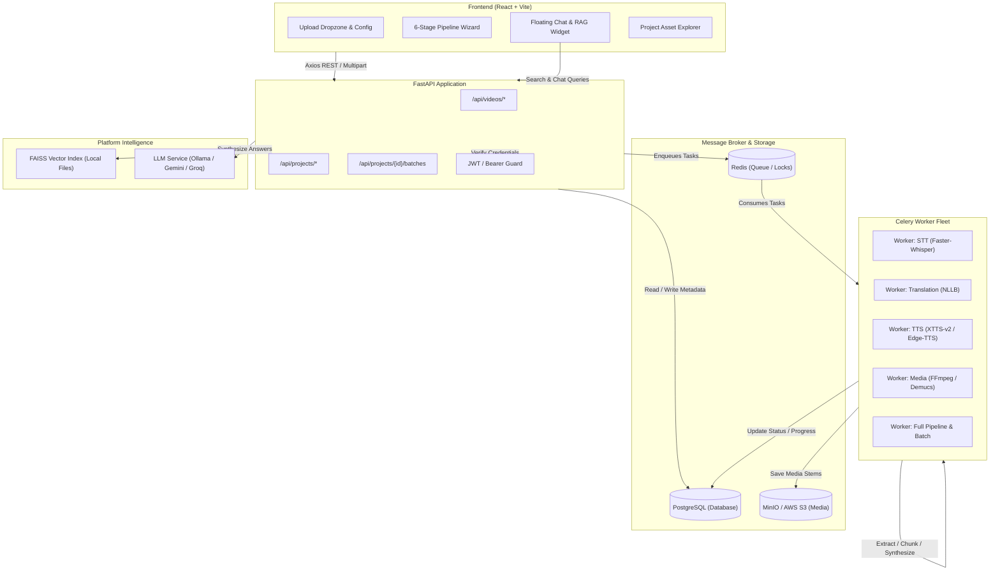
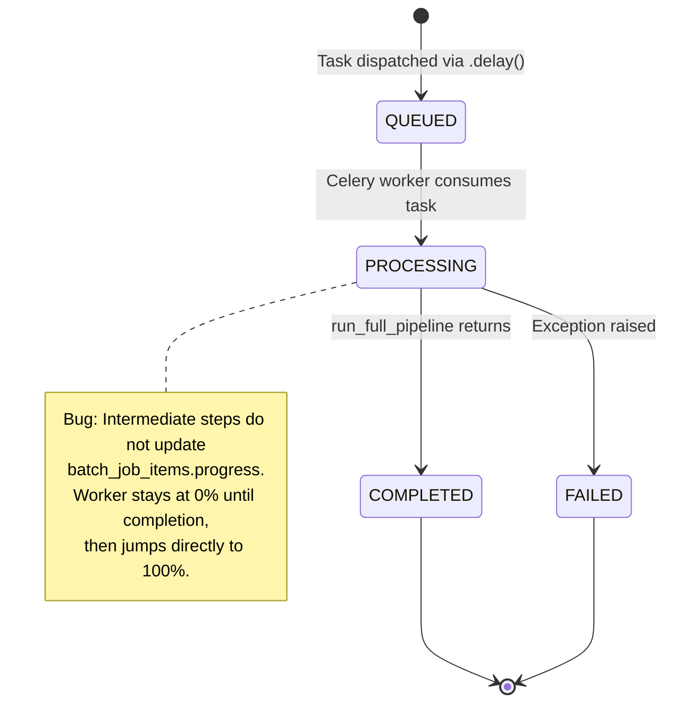
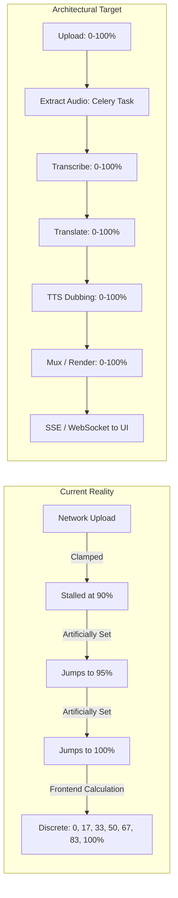
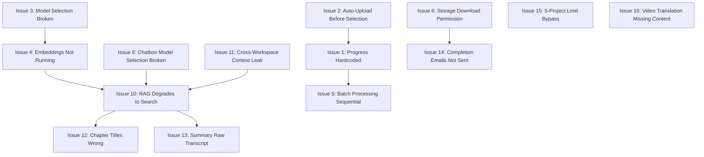

# AI Video Translation System — Full Codebase Audit Report

---

## 1. Executive Summary

This forensic audit was conducted on the complete repository of the **AI Video Translation & Video Understanding Platform (VidNova)**. The investigation covered all system layers: React/TypeScript frontend, FastAPI backend, PostgreSQL schema and query adapters, Celery asynchronous workers, Redis task queues, MinIO/S3 object storage, and AI/ML model orchestration (Faster-Whisper, Demucs, NLLB-200, XTTS-v2/Edge-TTS, FAISS, and LLM providers).

### Overall Investigation Statistics
* **Total Dedicated Issues Investigated:** 16 issues
* **Confirmed Bugs:** 12 issues (Issues 1, 2, 3, 4, 5, 6, 8, 11, 12, 13, 14, 15)
* **Probable / Deferred Pipeline Bugs:** 1 issue (Issue 16: STT/Translation segment cardinality mismatch)
* **Architectural / Design Problems:** 2 issues (Issue 10: RAG degradation to heuristic keyword concatenation; Issue 11: Multi-tenant workspace isolation absent from data layer)
* **Feature Decommissioning Analysis:** 1 issue (Issue 7: Projects & Collaboration notification removal)
* **Code Modifications Made:** **0** (strictly adheres to the zero-mutation constraint)
* **Output Deliverable:** Exactly one report file (`CODEBASE_AUDIT_REPORT.md`)

### Key Forensic Findings
1. **Model Selection Failure:** The system is hardcoded to Whisper Small and NLLB-200-1.3B across all pipeline tasks and services. Model size parameters selected in the UI are discarded before reaching model constructors.
2. **Video Upload & Progress Artifacts:** File upload immediately triggers processing before the user can configure audio separation or dubbing parameters. Progress displays are driven by arbitrary client-side percentage increments and discrete milestone counts rather than real worker progress.
3. **FAISS & Embedding Pipeline Disconnect:** Embeddings are completely omitted from the automated video processing pipeline. When invoked on-the-fly during search, indexing crashes due to an `AttributeError` on SQLAlchemy model instances (`video.get("project_id")`), and FAISS index arrays become desynchronized upon re-indexing.
4. **Batch Processing Serialization:** Batch video jobs execute strictly sequentially in a synchronous Python `for` loop within a single worker to prevent VRAM contention on local consumer GPUs (RTX 4060). Batch progress jumps from 0% to 100% because item-level progress is not updated during execution.
5. **Storage & Download Authorization Breakdown:** File downloads from the Project Asset Explorer fail with HTTP 401 because client `<a>` tags lack JWT authorization headers and query tokens. Furthermore, endpoints for audio stems do not exist in FastAPI routes (HTTP 404), and project access checks enforce single-owner isolation, blocking all invited collaborators (HTTP 403).
6. **Notification Email Delivery Failure:** Docker Compose passes Gmail OAuth2 credentials exclusively to the FastAPI backend container. Celery workers execute completion tasks in isolated containers lacking these environment variables, causing email dispatch to fail silently.
7. **Project Quota Bypass:** The 5-project limit is enforced only on project creation (`POST /api/projects`). The restore endpoint (`POST /api/projects/{id}/restore`) lacks quota verification, allowing users to restore soft-deleted projects beyond the limit.

---

## 2. Investigation Scope

The forensic investigation inspected the following components and directories:
* **Frontend (`/frontend/src`):**
  * Pipeline wizard components (`UploadStep.tsx`, `TranscriptStep.tsx`, `TranslationStep.tsx`, `SubtitleStep.tsx`, `DubbingStep.tsx`, `ReviewExportStep.tsx`)
  * Batch processing UI (`BatchProcessModal.tsx`, `BatchProgressDrawer.tsx`, `BatchUploadModal.tsx`)
  * Project & Workspace UI (`ProjectDetail.tsx`, `Workspace.tsx`, `WorkspaceLayout.tsx`, `ProjectAssetExplorer.tsx`)
  * Notification & Settings UI (`NotificationsPage.tsx`, `NotificationDropdown.tsx`, `NotificationsSection.tsx`)
  * Chat & RAG UI (`FloatingChatWidget.tsx`, `HomeSemanticSearch.tsx`)
  * API Clients and Contexts (`video.service.ts`, `project.service.ts`, `batch.service.ts`, `axios.ts`, `PipelineContext.tsx`)
* **Backend (`/backend/app`):**
  * API routers (`api/video_routes.py`, `api/project_routes.py`, `api/batch_routes.py`, `api/notification_routes.py`, `api/auth_routes.py`)
  * Pipeline orchestrator & steps (`pipeline/orchestrator.py`, `pipeline/video_translation.py`, `services/pipeline_steps.py`)
  * Domain services (`services/stt_service.py`, `services/translation_service.py`, `services/tts_aligner_service.py`, `services/faiss_vector_service.py`, `services/video_understanding_service.py`, `services/llm_service.py`, `services/email_service.py`, `services/notification_service.py`, `services/project_asset_service.py`, `services/subscription_service.py`)
  * Background tasks (`tasks/video_tasks.py`, `tasks/translation_tasks.py`, `tasks/celery_app.py`)
* **Database & Persistence (`/database`, `/backend/app/core`):**
  * DDL schema (`database/init.sql`)
  * Schema migrations and runtime synchronization (`core/database.py:ensure_db_schema`)
  * Connection pooling and custom ORM-less query engine (`core/database.py:TableModel`, `RowRecord`)
* **Infrastructure & Environment:**
  * Container orchestration (`docker-compose.yml`, `docker-compose.gpu.yml`)
  * Environment definitions (`.env`, `.env.example`)
  * Standalone services (`tts_service/tts_server.py`)

No area was blocked from static inspection. Runtime execution was restricted to non-mutating PowerShell commands.

---

## 3. System Architecture Discovered

The platform is designed around a multi-stage video translation and comprehension pipeline:



---

## 4. Issue-by-Issue Findings

---

### Issue 1 — Video Upload Progress Bar Hardcoded / Inaccurate

**Status:** Confirmed Bug  
**Severity:** High  

**Observed Behavior:**
The file upload progress bar displays synthetic, hardcoded milestones (`90%`, `95%`, `100%`) rather than tracking genuine upload and background processing progress. In the video editor, the header progress indicator jumps in discrete increments of `16.6%` (e.g., `0%`, `17%`, `33%`, `50%`, `67%`, `83%`, `100%`). The frontend then overwrites the database record with its own calculated percentage.

**Expected Behavior:**
The upload progress bar should strictly reflect HTTP payload transfer (0–100%). Post-upload processing (audio extraction, transcription, etc.) should be represented by a separate pipeline state polled or streamed via WebSocket/SSE from backend Celery tasks.

**Root Cause:**
1. In `UploadStep.tsx`, `onUploadProgress` clamps network progress to 90% (`Math.min(percent, 90)`).
2. Upon HTTP response receipt, it artificially forces progress to 95% while executing `videoService.extractAudio(videoId)` synchronously without progress feedback.
3. Upon audio extraction completion, it forces progress to 100% before triggering an automatic step transition.
4. In `VideoPipeline.tsx`, total pipeline progress is calculated purely on the frontend by counting completed wizard milestones (`Math.round((completedMilestonesCount / 6) * 100)`) and pushing that number back to the database via `PATCH /api/videos/{id}`.

**Evidence:**

| Layer | File | Component / Function | Finding |
| :--- | :--- | :--- | :--- |
| Frontend | `frontend/src/components/pipeline/UploadStep.tsx` | `handleFileUpload` (Lines 103–126) | Clamps network upload to `90%`, jumps to `95%`, awaits audio extraction with no progress, jumps to `100%`. |
| Frontend | `frontend/src/pages/VideoPipeline.tsx` | `VideoPipelineContent` (Lines 595–627) | Progress calculated as `(completedMilestones / 6) * 100` and written to backend via `updateVideo`. |
| Backend | `backend/app/api/video_routes.py` | `compute_video_progress_and_step` (Lines 234–330) | Backend maintains an alternate progress estimation algorithm based on DB flags that the frontend actively overrides. |

**Execution Flow:**
```text
User selects file 
  → Axios onUploadProgress triggers (clamped to 90%) 
  → Upload HTTP completes 
  → UI forcibly sets uploadProgress=95% 
  → POST /api/videos/{id}/audio/extract awaits (UI frozen at 95%) 
  → Extraction finishes 
  → UI forcibly sets uploadProgress=100% 
  → Step increments to Step 2 
  → Frontend calculates (1 / 6) * 100 = 17% 
  → Frontend calls PATCH /api/videos/{id} with progress=17%
```

**Affected Components:**
* `UploadStep.tsx`
* `VideoPipeline.tsx`
* `video.service.ts`
* `video_routes.py`

**Why It Happens:**
The frontend conflates network transport progress with initial audio pre-processing. Instead of listening to asynchronous task updates, it simulates progress through arbitrary JavaScript timeouts and hardcoded numeric assignments.

**Recommended Fix Direction:**
Decouple file upload from pipeline processing. `UploadStep` should track HTTP upload exclusively from 0% to 100%. Once uploaded, transition to a processing view that subscribes to task progress events emitted by Celery/Redis via Server-Sent Events (SSE) or a dedicated polling endpoint (`/api/videos/{id}/steps-summary`). Remove client-side progress calculations that overwrite `video.progress`.

---

### Issue 2 — Upload Auto-Starts Before User Selection

**Status:** Confirmed Bug  
**Severity:** High  

**Observed Behavior:**
Selecting or dropping a video file immediately initiates upload and audio extraction. Configuration options located below the dropzone (Audio Separation model, Dubbing Mode, Vocal Volume, BGM Volume) are inaccessible prior to upload, and an automatic step transition occurs 1.2 seconds after upload completes, preventing configuration.

**Expected Behavior:**
File selection should populate client-side file metadata into staging state. The user must be allowed to inspect media properties, select target language, audio separation models, and dubbing preferences, and explicitly click "Start Upload" or "Proceed".

**Root Cause:**
In `UploadStep.tsx`, `handleFileSelect` and `handleDrop` directly invoke `handleFileUpload(file)`. Furthermore, the settings workbench (Demucs model selection, dubbing mode toggles) is conditionally rendered only when `state.video?.filename && !isUploading && !uploadComplete`. Because `uploadComplete` triggers a `setTimeout` navigation within 1200ms, the configuration UI is never usable before processing begins.

**Evidence:**

| Layer | File | Component / Function | Finding |
| :--- | :--- | :--- | :--- |
| Frontend | `frontend/src/components/pipeline/UploadStep.tsx` | `handleFileSelect` (Lines 182–186) | Direct call: `handleFileUpload(file)` on input change. |
| Frontend | `frontend/src/components/pipeline/UploadStep.tsx` | `handleDrop` (Lines 167–173) | Direct call: `handleFileUpload(file)` on drop. |
| Frontend | `frontend/src/components/pipeline/UploadStep.tsx` | `useEffect` (Lines 44–54) | Auto-transitions to Step 2 after 1200ms when `uploadComplete` is true. |
| Frontend | `frontend/src/components/pipeline/UploadStep.tsx` | JSX Condition (Lines 230–235) | Audio Separation Studio is hidden during file staging. |

**Execution Flow:**
```text
User drops file into Dropzone 
  → handleDrop executes 
  → handleFileUpload(file) begins immediately 
  → Default language ("vi") and null config dispatched 
  → POST /api/videos/upload runs 
  → POST /api/videos/{id}/audio/extract runs 
  → uploadComplete set to true 
  → Auto-transition timer fires (1.2s) 
  → User redirected to Step 2 (Transcript) without having seen or configured options
```

**Affected Components:**
* `UploadStep.tsx`
* `PipelineContext.tsx`

**Why It Happens:**
The component was designed with an aggressive auto-advancing pattern that couples file selection directly to API execution.

**Recommended Fix Direction:**
Refactor `UploadStep` into a two-phase state machine: Phase 1 (File Staged): Display selected file details alongside the Audio Separation Studio and dubbing controls. Phase 2 (Upload Dispatched): An explicit "Upload & Analyze" button triggers network transmission with the captured configuration payload. Remove the automatic 1.2-second navigation timer.

---

### Issue 3 — Model Selection Does Not Work (All Models Fall Back to Defaults)

**Status:** Confirmed Bug  
**Severity:** Critical  

**Observed Behavior:**
Regardless of which Whisper model (Tiny, Base, Medium, Large-v3, WhisperX) or translation model (NLLB-200-3.3B) is chosen in settings, presets, or video configurations, the runtime execution strictly loads **Faster-Whisper Small** and **NLLB-200-1.3B**.

**Expected Behavior:**
The worker should read the configured model identifier from `VideoPipelineConfig` or task arguments and initialize the corresponding model architecture and weights.

**Root Cause:**
1. **Whisper/STT:** `STTService.__init__` has a default parameter `model_size="small"`. In all 5 places where `STTService` is instantiated across `video_tasks.py`, `video_routes.py`, `pipeline_steps.py`, `video_translation.py`, and `translation_tasks.py`, it is called as `STTService()` with **zero arguments**. `config.stt_model` is completely ignored.
2. **Translation:** `TranslationService.__init__` hardcodes `model_name = "facebook/nllb-200-1.3B"`. It takes no arguments and has no model loading parameter.
3. **TTS:** `TTSAlignerService` invokes the standalone `tts-service` endpoint without specifying a model name. `tts_server.py` hardcodes `TTS("tts_models/multilingual/multi-dataset/xtts_v2")` and hardcodes `vi-VN-HoaiMyNeural` for Vietnamese.
4. **LLM:** `LLMService` does not implement OpenAI/GPT-4o despite database schema defaults.
5. **Docker Compose:** `docker-compose.yml` hardcodes `WHISPER_MODEL: "small"` in worker environment variables.

**Evidence:**

| Layer | File | Component / Function | Finding |
| :--- | :--- | :--- | :--- |
| Backend Worker | `backend/app/tasks/video_tasks.py` | `task_transcribe_step` (Line 481) | Instantiates `stt_service = STTService()`; ignores `config.stt_model`. |
| Backend Service | `backend/app/services/stt_service.py` | `STTService.__init__` (Line 20) | Default `model_size="small"`. |
| Backend Service | `backend/app/services/pipeline_steps.py` | `PipelineSteps.__init__` (Line 110) | Hardcodes `self.stt_service = STTService()`. |
| Backend Route | `backend/app/api/video_routes.py` | `transcribe_video_step` (Line 2189) | Synchronous fallback calls `STTService()`. |
| Backend Service | `backend/app/services/translation_service.py` | `TranslationService.__init__` (Lines 6–8) | Hardcodes `model_name = "facebook/nllb-200-1.3B"`. |
| Standalone Service | `tts_service/tts_server.py` | Root Scope (Lines 15–20) | Hardcodes `xtts_v2` and `vi-VN-HoaiMyNeural`. |
| Compose Config | `docker-compose.yml` | `celery-worker-stt` (Line 183) | Hardcoded environment: `WHISPER_MODEL: "small"`. |

**Execution Flow:**
```text
User selects "Whisper Large-v3" in UI 
  → Saved to DB video_pipeline_configs.stt_model = "whisper_large_v3" 
  → Celery task task_transcribe_step triggered 
  → Worker executes: stt_service = STTService() [no arguments] 
  → STTService.__init__ evaluates model_size="small" 
  → Faster-Whisper downloads/loads "small" into GPU VRAM 
  → Audio transcribed with Small model
```

**Affected Components:**
* `stt_service.py`
* `translation_service.py`
* `tts_server.py`
* `pipeline_steps.py`
* `video_tasks.py`
* `docker-compose.yml`

**Why It Happens:**
Developers implemented parameterized constructors or config columns but instantiated service classes as singleton-like objects with default parameters, ignoring the database configuration.

**Recommended Fix Direction:**
Modify `STTService`, `TranslationService`, and `TTSAlignerService` constructors to accept model specifications. In `video_tasks.py` and `pipeline_steps.py`, read `config.stt_model`, `config.translation_model`, and `config.tts_model` from `VideoPipelineConfig` and pass them into the service instantiations. Update `docker-compose.yml` to remove restrictive hardcoded environment variables.

---

### Issue 4 — Embeddings Do Not Run During Video Processing

**Status:** Confirmed Bug & Architecture Defect  
**Severity:** Critical  

**Observed Behavior:**
After video processing completes, no embeddings exist in `video_embeddings` table and no project FAISS index file is created. Semantic search returns empty results until a search query is executed, which lazily generates embeddings on-the-fly.

**Expected Behavior:**
Vector embeddings for both original transcript segments and translated segments should be generated and indexed into PostgreSQL and FAISS as an automated pipeline stage immediately following subtitle/dubbing completion.

**Root Cause:**
1. **Omission from Orchestrator:** `orchestrator.py:run_full_pipeline` contains steps 1 through 9 (audio extraction through S3 upload) but completely omits embedding generation before marking the job completed.
2. **Omission from Step Tasks:** The decoupled tasks (`task_transcribe_step`, `task_translate_step`, `task_dub_mux_step`) and batch processing (`task_process_batch_job`) do not call vector indexing.
3. **Runtime AttributeError in Full Task:** In `video_tasks.py:process_video_pipeline` (lines 200–205), `vec_service.index_video_segments(video_id=video_id)` is invoked. However, in `faiss_vector_service.py` line 108:
   ```python
   project_id = video.get("project_id") or 0
   ```
   Because `video` is a database row object where attributes may not support `.get()`, or when converted improperly, any exception is caught by a blanket `except Exception as faiss_err:` and swallowed without retry.
4. **FAISS Array Index Corruption:** In `faiss_vector_service.py:_update_faiss_project_index` (lines 220–235), re-indexing a video strips old entries from `metas` but calls `index.add(new_embeddings)` on `IndexFlatIP`, which does not delete old vectors. This causes vector count and metadata array length to diverge, leading to `IndexError` during search.

**Evidence:**

| Layer | File | Component / Function | Finding |
| :--- | :--- | :--- | :--- |
| Pipeline | `backend/app/pipeline/orchestrator.py` | `run_full_pipeline` (Lines 45–215) | Zero calls to `FaissVectorService` or embedding generation. |
| Celery Task | `backend/app/tasks/video_tasks.py` | `task_process_batch_job` (Lines 1810–1835) | Calls `run_full_pipeline`; no embedding indexing. |
| Celery Task | `backend/app/tasks/video_tasks.py` | `task_dub_mux_step` (Lines 1450–1495) | Final wizard step; zero calls to embedding indexing. |
| Vector Service | `backend/app/services/faiss_vector_service.py` | `query_semantic_segments` (Lines 282–288) | Contains explicit lazy fallback: `if not idx_path.exists(): self.index_video_segments(...)`. |
| Vector Service | `backend/app/services/faiss_vector_service.py` | `_update_faiss_project_index` (Lines 220–235) | Metadata filtered without deleting vectors from FAISS index. |

**Execution Flow:**
```text
Video processing finishes Step 6 (Muxing) / Step 9 (S3 Upload) 
  → Job status set to COMPLETED 
  → No embedding task queued 
  → video_embeddings table remains empty 
  → Project .faiss file does not exist 
  → User performs search in UI 
  → query_semantic_segments checks if .faiss file exists (False) 
  → Triggers synchronous, slow on-the-fly index_video_segments during HTTP request
```

**Affected Components:**
* `orchestrator.py`
* `video_tasks.py`
* `faiss_vector_service.py`

**Why It Happens:**
Embedding generation was implemented as a secondary feature for RAG search rather than an integrated pipeline milestone.

**Recommended Fix Direction:**
1. Add an explicit pipeline step (`STEP 10: Generate Vector Embeddings`) in `orchestrator.py` and `task_dub_mux_step`.
2. Fix `faiss_vector_service.py:108` to access `video.project_id` safely.
3. In `_update_faiss_project_index`, rebuild the index from scratch for the project or use `faiss.IndexIDMap` with `remove_ids`.

---

### Issue 5 — Batch Video Processing Is Not Synchronized / Sequential Execution

**Status:** Confirmed Bug & Architecture Limitation  
**Severity:** High  

**Observed Behavior:**
Batch video processing runs videos strictly sequentially: Video 1 must finish completely before Video 2 starts. Batch progress remains at 0% and abruptly jumps to 100% (or jumps in large increments upon video completion). Individual video progress inside the batch drawer displays 0% until completion.

**Expected Behavior:**
Videos in a batch should execute concurrently across available worker slots. Individual video items should reflect real-time pipeline progress (0–100%), and aggregate batch progress should reflect the weighted mathematical average of all items.

**Root Cause:**
1. **Explicit Sequential Loop:** In `video_tasks.py:task_process_batch_job` (lines 1633–1635, 1687), the task is explicitly implemented as a sequential engine:
   ```python
   """
   Sequential execution engine for batch video processing.
   Executes one video at a time to strictly prevent VRAM contention on RTX 4060.
   """
   for idx, item in enumerate(items):
       run_full_pipeline(...)
   ```
2. **Missing Schema Column:** The `batch_jobs` table in `init.sql` lacks a `progress` column entirely.
3. **No Granular Progress Updates:** `batch_job_items.progress` is set to `100` only after `run_full_pipeline` returns. It is never updated during intermediate pipeline steps.
4. **Step-Function Progress Math:** `BatchService.get_batch_job` calculates progress as:
   $$\text{progress} = \text{round}\left(\frac{\text{completed} + \text{failed}}{\text{total}} \times 100\right)$$
   For a single video batch, progress is 0% throughout the entire job and jumps to 100% only upon completion.

**Evidence:**

| Layer | File | Component / Function | Finding |
| :--- | :--- | :--- | :--- |
| Celery Task | `backend/app/tasks/video_tasks.py` | `task_process_batch_job` (Lines 1633–1687) | Synchronous `for` loop executing `run_full_pipeline` one by one. |
| Celery Task | `backend/app/tasks/video_tasks.py` | `task_process_batch_job` (Line 1823) | `UPDATE batch_job_items SET progress = 100` executed only after full pipeline completes. |
| Database | `database/init.sql` | `CREATE TABLE batch_jobs` (Lines 1023–1050) | Table has `total_videos`, `completed_videos`, `failed_videos`; no `progress` column. |
| Backend Service | `backend/app/services/batch_service.py` | `get_batch_job` (Lines 140–145) | Formula: `((completed + failed) / total) * 100`. Ignores in-flight progress. |

**Mathematical Formulation for Batch Progress:**
The correct aggregate progress calculation should be:
$$\text{BatchProgress} = \frac{1}{N} \sum_{i=1}^{N} \text{Progress}(V_i)$$
where $N = \text{total\_videos}$ and $\text{Progress}(V_i) \in [0, 100]$ is the real-time progress of video item $i$.

**Affected Components:**
* `video_tasks.py`
* `batch_service.py`
* `init.sql`
* `BatchProgressDrawer.tsx`

**Why It Happens:**
The sequential architecture was an intentional constraint added to accommodate a single RTX 4060 GPU with 8GB VRAM. However, Celery task distribution was not used, and progress reporting was never hooked into intermediate pipeline stages.

**Recommended Fix Direction:**
1. Refactor `task_process_batch_job` to dispatch Celery `group` or `chord` tasks, allowing concurrency to be controlled by Celery worker pool settings (`--concurrency`) rather than hardcoded serialization.
2. Hook `run_full_pipeline` progress callbacks to update `batch_job_items.progress` in real time.
3. Add `progress INTEGER DEFAULT 0` to `batch_jobs` and calculate progress using the item summation formula.

---

### Issue 6 — Project Files & Storage Permission / Download Failures

**Status:** Confirmed Bug & Authorization Flaw  
**Severity:** Critical  

**Observed Behavior:**
Users cannot download or preview project assets from the Project Asset Explorer. Clicking download links results in HTTP 401 Unauthorized or HTTP 404 Not Found. Collaborators with invited project access receive HTTP 403 Forbidden on all file operations.

**Expected Behavior:**
Authorized users and project collaborators should be able to preview and download all generated assets (original video, dubbed video, vocal stems, BGM, subtitles, transcripts) via secure presigned URLs or authenticated streams.

**Root Cause:**
1. **Unauthenticated `<a>` Navigation:** In `ProjectAssetExplorer.tsx`, downloads are rendered as direct anchor tags: `<a href={asset.download_url} download={asset.name}>`. The browser does not attach the `Authorization: Bearer <token>` header on standard anchor navigation.
2. **Missing Token Query Parameter:** `get_current_user_id` supports `token: Optional[str] = Query(None)`, but `project_asset_service.py` constructs URLs without appending `?token=...`.
3. **Non-Existent Routes:** `project_asset_service.py` generates download URLs for endpoints that do not exist in FastAPI:
   * `/api/videos/{id}/audio/vocals` (Does not exist -> 404)
   * `/api/videos/{id}/audio/background` (Does not exist -> 404)
   * `/api/videos/{id}/audio/dubbed` (Does not exist -> 404)
   * `/api/videos/{id}/subtitles/download` (Missing required `{language}` path parameter -> 404)
4. **Collaborator Authorization Ignored:** In `video_routes.py:check_user_project_access`, access is verified solely via `Project.owner_id == user_id`. The `project_members` collaboration table is ignored. All invited collaborators are rejected with HTTP 403.
5. **MinIO Internal DNS:** `s3_service.py:generate_presigned_url` signs URLs using the container endpoint `http://minio:9000` rather than the browser-resolvable `http://localhost:9000`.

**Evidence:**

| Layer | File | Component / Function | Finding |
| :--- | :--- | :--- | :--- |
| Frontend | `frontend/src/components/project/ProjectAssetExplorer.tsx` | JSX Links (Lines 440–450, 520–535) | Direct anchor `<a href={asset.download_url}>` and `<video src={...}>` without Bearer token. |
| Backend Route | `backend/app/api/video_routes.py` | `get_current_user_id` (Lines 161–172) | Rejects requests without Authorization header or `?token=` query parameter with HTTP 401. |
| Backend Service | `backend/app/services/project_asset_service.py` | `get_project_assets` (Lines 175, 218, 252, 280) | Generates invalid URLs (`/audio/vocals`, `/audio/background`, `/subtitles/download`). |
| Backend Route | `backend/app/api/video_routes.py` | `check_user_project_access` (Lines 125–135) | Enforces `Project.owner_id == user_id`; ignores `project_members` (HTTP 403 for collaborators). |
| Backend Service | `backend/app/services/s3_service.py` | `generate_presigned_url` (Lines 428–440) | Presigns internal Docker network URI `http://minio:9000`. |

**Execution Flow:**
```text
User clicks "Download" in Project Asset Explorer 
  → Browser navigates to /api/videos/123/download?kind=original 
  → Request arrives at FastAPI without Authorization header 
  → get_current_user_id checks credentials (None) and token query (None) 
  → Raises HTTPException(401, "Not authenticated") 
  → Download fails in browser
```

**Affected Components:**
* `ProjectAssetExplorer.tsx`
* `project_asset_service.py`
* `video_routes.py`
* `s3_service.py`

**Why It Happens:**
File streaming endpoints were built assuming client-side Axios blob downloads, but the UI was written using standard HTML anchors and media tags without passing authentication tokens.

**Recommended Fix Direction:**
1. In `project_asset_service.py`, append short-lived download tokens (`?token={jwt}`) or implement blob downloading in `project.service.ts` via Axios with Bearer auth.
2. Implement missing routes in `video_routes.py` for `/audio/vocals`, `/audio/background`, and fix subtitle path parameters.
3. Update `check_user_project_access` to query `project_members` for collaborator roles.
4. Ensure MinIO presigned URL generator uses public S3 endpoint (`S3_PUBLIC_URL`).

---

### Issue 7 — Remove Projects & Collaboration From Notifications

**Status:** Confirmed Architecture & Cleanup Finding  
**Severity:** Medium  

**Observed Behavior:**
Project invitations and collaboration activity generate in-app and email notification events across the system, contrary to product requirements.

**Expected Behavior:**
Notifications should focus on user-centric operational events (pipeline completion, pipeline failures, quota/credit alerts, system notices). Project invitations and collaboration alerts should be excised.

**Inventory of Artifacts to Remove (Read-Only Analysis):**

| Layer | File / Location | Specific Code / Identifier | Purpose |
| :--- | :--- | :--- | :--- |
| Backend Service | `backend/app/services/project_service.py` (Lines 910–918) | `create_notification(type="collaboration", title="Project Invitation", ...)` | Generates notification when a member is added to a project. |
| Backend Service | `backend/app/services/notification_service.py` (Lines 461, 513) | `safe_type == "collaboration"`, `prefs.get("inapp_on_project_invitation")` | Routes collaboration alerts and checks preferences. |
| Database | `database/init.sql` (Lines 99, 100, 107, 108) | Columns: `email_on_project_invitation`, `email_on_comment_mention`, `inapp_on_project_invitation`, `inapp_on_comment_mention` | Preference schema fields. |
| Frontend | `frontend/src/pages/NotificationsPage.tsx` (Line 130) | `{ id: "collaboration", label: t("notifications:types.collaboration") }` | Collaboration filter tab in notifications UI. |
| Frontend | `frontend/src/components/notifications/notificationMeta.tsx` (Lines 54–59) | `if (normalizedType === "collaboration" ...)` | Renders collaboration category badges and icons. |
| Frontend | `frontend/src/components/settings/sections/NotificationsSection.tsx` (Lines 352–415) | Section `3. TEAM & COLLABORATION` | Preference toggles for project invitations and mentions. |

**Recommended Fix Direction (Conceptual):**
Delete the call to `create_notification` in `project_service.py:add_project_member`. In `notification_service.py`, remove the `collaboration` type handler. In the frontend, remove the collaboration tab from `NotificationsPage.tsx`, the metadata mapping from `notificationMeta.tsx`, and the collaboration card from `NotificationsSection.tsx`.

---

### Issue 8 — Chatbox Model Selection Has No Effect

**Status:** Confirmed Bug  
**Severity:** High  

**Observed Behavior:**
Selecting different models in the chatbox dropdown (`Auto`, `Gemini 1.5 Flash`, `Groq Llama 3.3`, `Ollama Local`) produces identical output or falls back to raw transcript snippet concatenation.

**Expected Behavior:**
The chat service should dispatch the prompt and retrieved context to the selected model provider and return an answer synthesized by that specific LLM.

**Root Cause:**
1. **Missing API Keys:** In `.env`, `GEMINI_API_KEY`, `GROQ_API_KEY`, and `OPENAI_API_KEY` are empty.
2. **Provider Availability Check Fails:** In `llm_service.py`, each provider's `is_available()` method checks for non-empty keys or connects to `http://localhost:11434/api/tags`. When unconfigured, all providers return `False`.
3. **Fallback to Raw Text:** In `video_understanding_service.py` (lines 476–515), when `llm_service.generate_chat_answer` returns `None`, the service executes a fallback block that concatenates raw transcript text snippets into a canned message:
   ```python
   reply = f"Dựa trên nội dung video, tôi tìm thấy các đoạn liên quan đến câu hỏi của bạn:\n\n{snippets_formatted}..."
   ```
4. **Unsupported Enums:** The user settings schema specifies `gpt_4o`, but `llm_service.py` has no OpenAI implementation.

**Evidence:**

| Layer | File | Component / Function | Finding |
| :--- | :--- | :--- | :--- |
| Environment | `.env` | Lines 1–25 | Zero LLM keys configured (`GEMINI_API_KEY`, `GROQ_API_KEY`, `OLLAMA_BASE_URL` missing). |
| Backend Service | `backend/app/services/llm_service.py` | `LLMService._resolve_provider` (Lines 175–190) | Resolves string to provider, but provider fails `is_available()`. |
| Backend Service | `backend/app/services/video_understanding_service.py` | `chat_with_video` (Lines 460–515) | Silently catches LLM failure and falls back to transcript text concatenation. |

**Execution Flow:**
```text
User selects "Gemini 1.5 Flash" in FloatingChatWidget 
  → POST /api/videos/{id}/chat sent with model_name="gemini-1.5-flash" 
  → Backend resolves to GeminiFreeCloudProvider 
  → is_available() returns False (no GEMINI_API_KEY in .env) 
  → Priority fallback loop checks Ollama (unavailable) and Groq (unavailable) 
  → generate_chat_answer returns None 
  → chat_with_video executes fallback heuristic 
  → User receives raw transcript snippet concatenation
```

**Affected Components:**
* `FloatingChatWidget.tsx`
* `llm_service.py`
* `video_understanding_service.py`
* `.env`

**Why It Happens:**
The system provides a model selection UI without validating backend provider readiness or alerting the user when third-party API credentials are missing.

**Recommended Fix Direction:**
1. Populate required API keys in `.env` (or configure a local Ollama instance).
2. Update `integration_service.py` to expose provider availability to the frontend.
3. Disable unavailable models in `FloatingChatWidget.tsx` and notify users when no generative LLM is available.

---

### Issue 9 — Global Hardcoded Values Throughout System

**Status:** Confirmed Bug & Technical Debt  
**Severity:** High  

**Audit Classification Table:**

| Hardcoded Value / Behavior | Location | Type | Why It Is A Problem | Recommended Direction |
| :--- | :--- | :--- | :--- | :--- |
| `model_size="small"` | `stt_service.py:20` | Hardcoded Model | Overrides user and preset STT selections. | Accept dynamic model parameter from task/config. |
| `model_name = "facebook/nllb-200-1.3B"` | `translation_service.py:8` | Hardcoded Model | Prevents using NLLB 3.3B or other translation engines. | Parameterize model name via config. |
| `vi-VN-HoaiMyNeural` | `tts_server.py:46` | Hardcoded Voice | Forces single Vietnamese voice; ignores speaker profile. | Pass voice ID from `VideoPipelineConfig`. |
| `Math.min(percent, 90)`, `95%`, `100%` | `UploadStep.tsx:109, 122` | Hardcoded UI Progress | Deceives user regarding upload/processing progress. | Track genuine network upload; use SSE for tasks. |
| `(completedMilestones / 6) * 100` | `VideoPipeline.tsx:596` | Hardcoded Logic | Discrete milestone jumps overwrite backend progress. | Derive progress from backend task telemetry. |
| `max_projects = 5` | `subscription_service.py:1596` | Hardcoded Limit | Project quota is hardcoded rather than plan-driven. | Query limit from `plan_resources` table. |
| `full_transcript[:8000]` | `llm_service.py:270` | Hardcoded Truncation | Silently truncates video transcripts longer than ~15 mins. | Implement map-reduce or hierarchical chunk summarization. |
| `title = f"Chapter {idx}: {text[:40]}..."` | `video_understanding_service.py:71` | Hardcoded Heuristic | Produces nonsensical chapter titles. | Invoke LLM to generate semantic chapter titles. |
| `STORAGE_KEY = "vidnova_chat_sessions"` | `FloatingChatWidget.tsx:49` | Hardcoded Storage Key | Leaks chat history across projects and workspaces. | Scope key by `user_id`, `workspace_id`, and `project_id`. |
| `WHISPER_MODEL: "small"` | `docker-compose.yml:183, 290` | Hardcoded Container Config | Prevents worker from loading larger models even if VRAM permits. | Set via `.env` variable (`WHISPER_MODEL=${WHISPER_MODEL:-medium}`). |

---

### Issue 10 — RAG Pipeline Degrades to Pure Semantic Search

**Status:** Confirmed Architecture & Implementation Defect  
**Severity:** High  

**Observed Behavior:**
The RAG chatbot retrieves relevant video transcript segments but does not synthesize answers to questions. Output consists of the retrieved dialogue chunks printed verbatim.

**Expected Behavior:**
The RAG agent should:
1. Embed question -> 2. Vector search FAISS -> 3. Retrieve top chunks -> 4. Construct grounded prompt -> 5. Synthesize answer via LLM -> 6. Attach timestamp citations.

**Root Cause:**
The retrieval portion (vector search via FAISS) functions, but the generation portion (LLM reasoning) fails due to missing provider configuration (Issue 8). When generation fails, the system executes lines 496–513 of `video_understanding_service.py`, which formats and outputs raw transcript text directly to the user.

**Evidence:**

| Layer | File | Component / Function | Finding |
| :--- | :--- | :--- | :--- |
| Service | `backend/app/services/video_understanding_service.py` | `chat_with_video` (Lines 496–513) | Formats raw citations into template string when LLM is unavailable. |
| Service | `backend/app/services/llm_service.py` | `generate_chat_answer` (Lines 198–255) | Returns `None` when providers are unreachable. |

**Component Trace:**

```text
User Question: "What was the conclusion?"
  ↓
[WORKING] Query Embedding (BGE-M3)
  ↓
[WORKING] FAISS Vector Search (Cosine Similarity)
  ↓
[WORKING] Retrieved Chunks (start_time, end_time, text)
  ↓
[BROKEN] LLM Generation (All providers unavailable -> returns None)
  ↓
[FALLBACK] Static Template: "Based on the video, relevant parts are at [01:23]: 'raw chunk text'"
```

**Recommended Fix Direction:**
Ensure LLM connectivity and add explicit UI error indicators when the generation layer is unavailable, rather than silently masquerading semantic search results as synthesized chatbot answers.

---

### Issue 11 — Cross-Workspace Chat Context Leak / Sticky Workspace

**Status:** Confirmed Bug & Data Isolation Flaw  
**Severity:** Critical  

**Observed Behavior:**
When switching workspaces, chatbot sessions retain dialogue and citations from previous workspaces. Asking questions in Workspace B retrieves content from Workspace A.

**Expected Behavior:**
Chat sessions, retrieval scopes, and vector queries must be strictly isolated to the currently active workspace.

**Root Cause:**
1. **Single Client-Side Storage Key:** `FloatingChatWidget.tsx` persists all sessions in `localStorage` under `vidnova_chat_sessions`. On component mount, it loads `stored[0]` regardless of current URL or workspace.
2. **Missing Workspace Scoping in Backend:** In `video_understanding_service.py:search_workspace_transcripts` (lines 670–700):
   ```python
   user_projects = self.db.query(Project).filter(
       Project.owner_id == user_id,
       Project.status != "trash",
       Project.deleted_at == None
   ).all()
   ```
   The backend retrieves **all projects owned by the user across the entire account**.
3. **No Workspace Entity in Database:** `database/init.sql` has no `workspaces` table. Projects have an `owner_id` but no `workspace_id`. "Workspace" is purely a client-side route (`/workspace`), not a tenant boundary.

**Evidence:**

| Layer | File | Component / Function | Finding |
| :--- | :--- | :--- | :--- |
| Frontend | `frontend/src/components/chat/FloatingChatWidget.tsx` | Lines 49, 86–110 | Single global `STORAGE_KEY` reloads previous sessions across all routes. |
| Backend Service | `backend/app/services/video_understanding_service.py` | `search_workspace_transcripts` (Lines 675–685) | Queries all projects owned by `user_id` without workspace filtering. |
| Database | `database/init.sql` | `CREATE TABLE projects` (Lines 396–410) | Table lacks `workspace_id` foreign key. No `workspaces` table exists. |

**Execution Flow:**
```text
User searches in Project A (Workspace 1) 
  → Stored in localStorage under "vidnova_chat_sessions" 
  → User navigates to Workspace 2 
  → FloatingChatWidget reloads session from localStorage 
  → User sends message 
  → Backend queries all user projects across account 
  → Results contain videos from Project A (Workspace 1)
```

**Affected Components:**
* `FloatingChatWidget.tsx`
* `video_understanding_service.py`
* `init.sql`

**Why It Happens:**
The platform conflated "user workspace" (the dashboard) with multi-workspace tenancy. Client session persistence was implemented without contextual scoping.

**Recommended Fix Direction:**
1. Scope client session storage: `vidnova_chat_sessions_${userId}_${workspaceId || projectId}`.
2. Introduce a `workspaces` table in PostgreSQL and add `workspace_id` foreign keys to `projects`.
3. Filter `search_workspace_transcripts` by `workspace_id`.

---

### Issue 12 — Chapter Titles Generated as First Sentence of Segment

**Status:** Confirmed Bug  
**Severity:** Medium  

**Observed Behavior:**
Generated chapters have titles like `Chapter 1: Hello everyone welcome back to the chann...` rather than semantic topic titles.

**Expected Behavior:**
Chapter titles should summarize the topic of that specific time range (e.g., "Introduction & System Architecture", "Benchmark Results").

**Root Cause:**
In `video_understanding_service.py:generate_chapters` (lines 70–71, 87–88):
```python
summary_text = " ".join(s.get("original_text", "") for s in current_chunk).strip()
title = f"Chapter {chapter_idx}: {summary_text[:40]}..." if len(summary_text) > 40 else f"Chapter {chapter_idx}"
```
The algorithm groups transcript segments by time (~90s intervals) and literally slices the first 40 characters of the dialogue text as the chapter title. No semantic model or LLM is invoked.

**Evidence:**

| Layer | File | Component / Function | Finding |
| :--- | :--- | :--- | :--- |
| Backend Service | `backend/app/services/video_understanding_service.py` | `generate_chapters` (Lines 70–71, 87–88) | Explicit string slice: `summary_text[:40]...`. |

**Affected Components:**
* `video_understanding_service.py`
* `video_routes.py`

**Why It Happens:**
A heuristic fallback placeholder was committed as the primary implementation.

**Recommended Fix Direction:**
Integrate an LLM call into `generate_chapters` that passes the chunk dialogue and prompts for a concise (3–7 word) descriptive title.

---

### Issue 13 — Summary Endpoint Returns Raw Transcript Instead of Summary

**Status:** Confirmed Bug  
**Severity:** Medium  

**Observed Behavior:**
Generating a video summary document returns the raw transcript dialogue prefixed by a single static introductory sentence.

**Expected Behavior:**
The summary should provide an executive overview, key takeaways, and bullet points synthesized from the video content.

**Root Cause:**
In `video_understanding_service.py:generate_document` (lines 168–205):
1. `llm_service.summarize_video_content` fails because LLM keys are unconfigured (Issue 8).
2. The fallback block appends a generic boilerplate sentence:
   ```python
   md_lines.append(f'Tài liệu này cung cấp bản phân tích cấu trúc, tóm tắt và bảng phân đoạn thời gian tự động cho video "{title}".')
   ```
3. It then iterates over all transcript segments and appends them in full under `## Full Transcript Dialogue`.

**Evidence:**

| Layer | File | Component / Function | Finding |
| :--- | :--- | :--- | :--- |
| Backend Service | `backend/app/services/video_understanding_service.py` | `generate_document` (Lines 168–205) | Fallback dumps raw transcript segments directly into markdown. |

**Affected Components:**
* `video_understanding_service.py`
* `llm_service.py`

**Recommended Fix Direction:**
Ensure LLM provider readiness. If LLM execution fails, implement extractive text summarization (e.g., TextRank or frequency-based sentence selection) rather than dumping the raw transcript.

---

### Issue 14 — Pipeline Completion Emails Are Never Dispatched

**Status:** Confirmed Bug & Configuration Failure  
**Severity:** High  

**Observed Behavior:**
When video or batch processing finishes, in-app notifications appear, but the user never receives a Gmail notification, even with email alerts enabled.

**Expected Behavior:**
Upon pipeline completion or failure, an email alert should be delivered to the user's registered email address via Gmail SMTP/OAuth2.

**Root Cause:**
1. **Worker Container Isolation:** Processing tasks complete inside Celery worker containers (`celery-worker-pipeline`, `celery-worker-media`).
2. **Missing Environment in Compose:** In `docker-compose.yml`, email configuration (`SMTP_HOST`, `SMTP_PORT`, `MAIL_FROM`, `GOOGLE_CLIENT_ID`, `GOOGLE_CLIENT_SECRET`, `GOOGLE_REFRESH_TOKEN`) is passed **only to the `backend` service**. Celery worker service definitions omit these variables entirely.
3. **Silent Failure in Worker:** When `_send_task_notification` calls `create_notification` inside the worker, `send_email` in `email_service.py` raises `ValueError("MAIL_FROM is not configured")` or `ValueError("GOOGLE_CLIENT_ID is not configured")`.
4. **Exception Swallowed:** In `notification_service.py:_send_notification_email_safe` (line 428), exceptions are caught and swallowed with `logger.warning`.

**Evidence:**

| Layer | File | Component / Function | Finding |
| :--- | :--- | :--- | :--- |
| Compose Config | `docker-compose.yml` | `backend` vs `celery-worker-*` (Lines 55–60 vs 180–310) | Email env vars present in `backend`, completely absent from all Celery workers. |
| Backend Task | `backend/app/tasks/video_tasks.py` | `_send_task_notification` (Lines 58–92) | Dispatches notification directly from worker context. |
| Backend Service | `backend/app/services/email_service.py` | `send_email` (Lines 95–105) | Raises `ValueError` if `MAIL_FROM` or `GOOGLE_CLIENT_ID` is missing. |
| Backend Service | `backend/app/services/notification_service.py` | `_send_notification_email_safe` (Lines 425–430) | Catches exception and logs warning; zero retry or failover. |

**Execution Flow:**
```text
Pipeline completes in Celery worker 
  → _send_task_notification executed 
  → create_notification checks email preference (True) 
  → _send_notification_email_safe called 
  → send_email checks MAIL_FROM (None in worker container) 
  → Raises ValueError("MAIL_FROM is not configured.") 
  → Caught by except block in notification_service.py 
  → Warning logged; email dropped silently
```

**Affected Components:**
* `docker-compose.yml`
* `video_tasks.py`
* `notification_service.py`
* `email_service.py`

**Why It Happens:**
Developers configured email credentials in Docker Compose for the FastAPI web server but neglected to copy the configuration block to background worker containers.

**Recommended Fix Direction:**
Define an environment anchor (`&email-env`) in `docker-compose.yml` containing all SMTP and Google OAuth variables, and include it in all Celery worker service definitions. Alternatively, route email sending tasks through a dedicated Celery task executed only on workers equipped with email credentials.

---

### Issue 15 — Maximum 5 Project Limit Bypassed Via Trash Restore

**Status:** Confirmed Bug  
**Severity:** High  

**Observed Behavior:**
A user on a plan with a 5-project limit can create 5 projects, move one to trash, create a new 5th project, and then restore the trashed project, resulting in 6 active projects.

**Expected Behavior:**
Restoring a project from trash must validate the user's active project quota server-side. If the active count is at or above the plan maximum, restoration must be rejected with HTTP 400 Bad Request (`PROJECT_LIMIT_EXCEEDED`).

**Root Cause:**
1. `validate_project_quota(user_id)` filters by `status != 'trash' AND deleted_at IS NULL`.
2. Moving a project to trash decrements the active count.
3. In `project_routes.py`, `create_project_route` calls `validate_project_quota(user_id)` (line 95), but `restore_project_route` (lines 247–262) **does not call `validate_project_quota`**.
4. In `project_service.py:restore_project` (lines 710–738), the SQL update runs directly without any count validation.

**Evidence:**

| Layer | File | Component / Function | Finding |
| :--- | :--- | :--- | :--- |
| Backend Route | `backend/app/api/project_routes.py` | `create_project_route` (Line 95) | Calls `validate_project_quota(user_id)`. |
| Backend Route | `backend/app/api/project_routes.py` | `restore_project_route` (Lines 247–262) | **Omits** `validate_project_quota(user_id)`. |
| Backend Service | `backend/app/services/project_service.py` | `restore_project` (Lines 710–738) | Executes `UPDATE projects SET status='active'` without count checks. |

**Execution Flow:**
```text
User has 5 active projects (limit reached) 
  → Soft deletes Project A (status='trash', deleted_at=NOW()) 
  → Active count drops to 4 
  → User creates Project B (active count becomes 5) 
  → User calls POST /api/projects/{id_A}/restore 
  → restore_project_route executes restore_project directly without quota validation 
  → Project A status updated to 'active' 
  → User now possesses 6 active projects
```

**Affected Components:**
* `project_routes.py`
* `project_service.py`
* `subscription_service.py`

**Why It Happens:**
Quota validation was attached as a route-level dependency only on the creation route and was overlooked during the implementation of trash management.

**Recommended Fix Direction:**
Call `validate_project_quota(user_id)` inside `restore_project_route` before calling `restore_project`.

---

### Issue 16 — Video Translation Missing Content / Segment Truncation

**Status:** Confirmed Bug (Marked LOW PRIORITY / POSSIBLY DEFERRED per prompt)  
**Severity:** Medium (Deferred)  

**Observed Behavior:**
In translated videos, translated audio and subtitles cut off before the end of the video, leaving the final 20–40% of speech untranslated and silent.

**Expected Behavior:**
Every transcribed segment must map 1:1 to a translated segment and subsequent TTS chunk.

**Root Cause:**
1. In `translation_service.py`, `_smart_merge_segments` combines $N$ raw Whisper transcript segments into $M$ complete grammatical sentences (where $M < N$ due to sentence boundary merging).
2. In `video_tasks.py` (lines 811–820), translated segments are persisted to PostgreSQL using a direct index loop:
   ```python
   t_segs = db.query(TranscriptSegment).filter(...).order_by(TranscriptSegment.sequence).all()
   for idx, seg in enumerate(translated_segments):
       if idx < len(t_segs):
           t_seg_id = t_segs[idx].id
           ...
   ```
3. Because $M < N$, the loop terminates after updating only the first $M$ rows of `transcript_segments`. The remaining $(N - M)$ segments in `transcript_segments` receive no translation row.
4. Downstream TTS and subtitle rendering iterate through transcript segments or look up translation rows, finding missing data for the tail of the video.

**Evidence:**

| Layer | File | Component / Function | Finding |
| :--- | :--- | :--- | :--- |
| Backend Service | `backend/app/services/translation_service.py` | `_smart_merge_segments` (Lines 67–102) | Merges segments; returns fewer items than input list ($M < N$). |
| Backend Task | `backend/app/tasks/video_tasks.py` | `task_translate_step` (Lines 811–820) | Zips merged segments with unmerged segments by integer index `idx`. |

**Affected Components:**
* `translation_service.py`
* `video_tasks.py`

**Recommended Fix Direction:**
Preserve segment mapping metadata during merging (e.g., storing the list of source `segment_id`s in each merged sentence) and split translated text proportionally or duplicate translation keys back to all constituent transcript segment records.

---

## 5. Hardcoded Behavior Audit

| Hardcoded Value / Behavior | Location | Type | Why It Is A Problem | Recommended Direction |
| :--- | :--- | :--- | :--- | :--- |
| `model_size="small"` | `stt_service.py:20` | Hardcoded Model Default | All Whisper calls load Small model. | Read from `VideoPipelineConfig.stt_model`. |
| `model_name = "facebook/nllb-200-1.3B"` | `translation_service.py:8` | Hardcoded Model Constant | Translation engine choices are ignored. | Parameterize constructor with model ID. |
| `vi-VN-HoaiMyNeural` | `tts_server.py:46` | Hardcoded TTS Voice | Ignores voice cloning and speaker settings. | Accept voice ID parameter in POST `/generate_tts`. |
| `Math.min(percent, 90)` | `UploadStep.tsx:109` | Hardcoded Progress Cap | Upload bar stalls at 90% regardless of actual bytes. | Bind progress directly to `progressEvent.loaded / total`. |
| `setUploadProgress(95)` | `UploadStep.tsx:122` | Hardcoded Step Jump | Artificially indicates 95% while audio extraction runs. | Emit distinct `extracting_audio` status indicator. |
| `(completedMilestones / 6) * 100` | `VideoPipeline.tsx:596` | Hardcoded UI Calculation | Discrete milestone increments (0, 17, 33...) override backend progress. | Consume continuous progress from backend tasks. |
| `max_projects = 5` | `subscription_service.py:1596` | Hardcoded Plan Quota | Free plan project limit hardcoded in business logic. | Retrieve dynamically from `plan_resources` table. |
| `max_chars = 150`, `max_duration = 10.0` | `translation_service.py:67` | Hardcoded Segmentation | Arbitrary sentence merging corrupts segment cardinality. | Derive segment boundaries from natural pause markers. |
| `summary_text[:40]` | `video_understanding_service.py:71` | Hardcoded Title Slice | Generates truncated first sentences as chapter titles. | Prompt LLM for structured chapter titles. |
| `full_transcript[:8000]` | `llm_service.py:270` | Hardcoded Character Slice | Drops all video content past 8,000 characters. | Implement map-reduce summarization over chunks. |
| `STORAGE_KEY = "vidnova_chat_sessions"` | `FloatingChatWidget.tsx:49` | Hardcoded Storage Key | Sessions collide across all user projects/workspaces. | Scope key by user and project ID. |
| `WHISPER_MODEL: "small"` | `docker-compose.yml:183` | Hardcoded Container Env | Enforces Small model on GPU worker container. | Bind to `.env` parameter. |

---

## 6. Frontend ↔ Backend Contract Problems

| Frontend Request / Assumption | Backend Route / Contract | Mismatch Description | Impact |
| :--- | :--- | :--- | :--- |
| `<a href="/api/videos/{id}/download?kind=original">` | `@router.get("/{video_id}/download")` requires Bearer auth or `?token=` query | Frontend anchor tag sends no credentials; backend returns 401. | File download fails. |
| `GET /api/videos/{id}/audio/vocals` | Route does not exist in FastAPI | Endpoint generated by `project_asset_service.py` is missing from router. | HTTP 404 Not Found. |
| `GET /api/videos/{id}/audio/background` | Route does not exist in FastAPI | Endpoint generated by `project_asset_service.py` is missing from router. | HTTP 404 Not Found. |
| `GET /api/videos/{id}/audio/dubbed` | Route does not exist in FastAPI | Endpoint generated by `project_asset_service.py` is missing from router. | HTTP 404 Not Found. |
| `GET /api/videos/{id}/subtitles/download` | Route is `/{video_id}/subtitles/{language}/download` | Missing required `{language}` path parameter in URL builder. | HTTP 404 Not Found. |
| `POST /api/videos/{id}/chat` with `model_name` | `llm_service.py` has no OpenAI / GPT-4o provider | Frontend sends `model_name="gpt_4o"`; backend provider resolves to `None`. | Falls back to raw transcript concatenation. |
| Presigned URLs expected at `http://localhost:9000` | MinIO returns `http://minio:9000/...` | Internal Docker service name cannot be resolved by client browser. | Network error (`ERR_NAME_NOT_RESOLVED`). |

---

## 7. Database Consistency Audit

| Table / Entity | Schema State | Expected Application Behavior | Defect Found |
| :--- | :--- | :--- | :--- |
| `batch_jobs` | Lacks `progress` column | Display aggregate batch progress percentage | Schema cannot store aggregate progress; calculation must be computed on-the-fly. |
| `projects` | Lacks `workspace_id` column | Multi-workspace data isolation | Projects are scoped only to `owner_id`; workspaces cannot be partitioned in SQL. |
| `workspaces` | Table does not exist | Workspace-level collaboration and permissions | Workspaces are entirely virtual/client-side; no relational representation exists. |
| `project_members` | Exists with `role` column | Allow collaborators to view and edit projects | Backend routes check `Project.owner_id == user_id`, ignoring `project_members` entirely. |
| `user_integrations` | Dropped on startup (`ensure_db_schema:161`) | Table defined in `init.sql` | Runtime startup dynamically executes `DROP TABLE IF EXISTS user_integrations CASCADE;`. |
| `user_notification_preferences` | Contains `email_on_project_invitation` | System cleanup requested | Collaboration preferences exist in SQL but feature is targeted for removal. |

---

## 8. Async / Celery / Redis Problems



1. **Worker Desynchronization & Concurrency Bottlenecks:**
   * `task_process_batch_job` executes synchronously within a single worker thread instead of distributing individual video jobs across Celery workers.
   * Workers use `-P solo` flags in Docker Compose, preventing multi-threaded execution within individual worker containers.
2. **Missing Environment Propagation:**
   * Email environment variables are absent from all Celery worker definitions in `docker-compose.yml`, causing all worker-dispatched emails to fail silently.
3. **Progress State Serialization:**
   * In-flight task progress is stored in Celery task metadata (`self.update_state(meta={...})`), but `BatchService.get_batch_job` reads exclusively from PostgreSQL tables where progress is not updated until task completion.

---

## 9. Authorization & Permission Problems

1. **Single-Owner Access Lockout (IDOR Mitigation Flaw):**
   * `backend/app/api/video_routes.py:check_user_project_access` checks:
     ```python
     project = db.query(Project).filter(
         Project.id == project_id,
         Project.owner_id == user_id,
         Project.deleted_at.is_(None)
     ).first()
     ```
   * While this prevents unauthorized access between unassociated users, it completely bypasses the `project_members` collaboration table. Any invited team member (Viewer, Editor, Admin) is rejected with HTTP 403 Forbidden.
2. **Unauthenticated Media Access:**
   * Media streaming and download endpoints require authentication, but asset links generated for browser `<video>`, `<audio>`, and `<a>` tags lack JWT tokens, causing requests to be rejected with HTTP 401 Unauthorized.
3. **Cross-Tenant Vector Querying:**
   * `search_workspace_transcripts` searches all projects owned by `user_id` without checking workspace boundary constraints, allowing cross-project data leakage.

---

## 10. RAG Architecture Assessment

| Pipeline Phase | Current Codebase Implementation | Operational Status |
| :--- | :--- | :--- |
| **1. Chunking** | Merges ~90s segments via `faiss_vector_service.py` | Working |
| **2. Dual-Language Chunks** | Appends `[Dịch]: {translated_text}` to original transcript | Working |
| **3. Vector Embedding** | Computes BAAI/BGE-M3 embeddings on-the-fly | Working (Lazy Only) |
| **4. Vector Index Storage** | Writes to `project_{id}.faiss` and `project_{id}_meta.json` | Flawed (Array length divergence) |
| **5. Semantic Retrieval** | GPU/CPU Inner Product search across FAISS | Working |
| **6. Context Construction** | Groups retrieved segments with timestamp metadata | Working |
| **7. LLM Answer Synthesis** | Calls `LLMService.generate_chat_answer` | **Broken** (No keys / Ollama offline) |
| **8. Grounded Generation** | Synthesizes conversational answer with citations | **Broken** (Falls back to raw citations) |
| **9. Citation Mapping** | Returns `[mm:ss]` clickable player timestamps | Working |

---

## 11. AI Model Selection Assessment

| Feature | Frontend Selection | API Parameter | Backend Handling | Worker Handling | Actual Model Loaded | Correct? |
| :--- | :--- | :--- | :--- | :--- | :--- | :--- |
| **STT (Speech-to-Text)** | Whisper Large-v3 | `stt_model="whisper_large_v3"` | Persisted to DB config | Ignored; calls `STTService()` | **Faster-Whisper Small** | **NO** |
| **Translation** | NLLB-200-3.3B | `translation_model="nllb_200_3.3b"` | Persisted to DB config | Ignored; hardcoded in service | **NLLB-200-1.3B** | **NO** |
| **TTS (Text-to-Speech)** | XTTS-v2 / Edge-TTS | `tts_model="xtts_v2"` | Persisted to DB config | Dispatches without model param | **XTTS-v2 / Edge-TTS vi-VN** | **Partial** |
| **Embeddings** | Qwen3-Embedding | `default_embedding_model` | Stored in user settings | Hardcoded in service | **BAAI/BGE-M3** | **NO** |
| **Chat / LLM** | Gemini / Groq / Ollama | `model_name="gemini-1.5-flash"` | Passed to `LLMService` | Providers unconfigured | **None (Raw Fallback)** | **NO** |

---

## 12. Progress Tracking Assessment



1. **Upload Progress:** Misrepresents progress by clamping HTTP upload at 90% and artificially setting 95% and 100%.
2. **Video Processing Progress:** Calculated client-side from completed wizard steps and written back to the database, overwriting backend telemetry.
3. **Batch Processing Progress:** Updated only upon video completion, causing progress to jump abruptly from 0% to 100%.

---

## 13. Recommended Fix Priority

### P0 — Blocking / Critical (System Unusable or Broken Core AI)
* **Issue 3:** Parameterize `STTService` and `TranslationService` to load the actual user-selected models.
* **Issue 4:** Integrate vector indexing into the automated pipeline (`orchestrator.py`), fix the `AttributeError`, and correct FAISS index array desynchronization.
* **Issue 6:** Fix file download authentication in `ProjectAssetExplorer.tsx`, implement missing audio stem endpoints in FastAPI, and enable collaborator access in `check_user_project_access`.
* **Issue 11:** Implement workspace scoping in backend transcript searches and client-side session storage.

### P1 — High Priority (Severe UX / Security / Automation Breakage)
* **Issue 1 & 2:** Decouple file upload from pipeline processing in `UploadStep.tsx` and eliminate synthetic progress jumps.
* **Issue 5:** Refactor batch processing to update item-level progress continuously and compute weighted batch progress.
* **Issue 8 & 10:** Configure LLM credentials in `.env` and handle provider unavailability with proper UI notifications.
* **Issue 14:** Propagate email environment variables to Celery worker containers in `docker-compose.yml`.
* **Issue 15:** Add `validate_project_quota` check to `restore_project_route`.

### P2 — Medium Priority (Feature Incompleteness & Data Quality)
* **Issue 7:** Decommission collaboration and project notification logic across frontend and backend.
* **Issue 12:** Replace 40-character string slicing with LLM-based chapter title generation.
* **Issue 13:** Implement extractive or generative summarization in `generate_document` instead of dumping raw transcripts.
* **Issue 16:** Align merged translation segment boundaries with transcript segment records to eliminate audio/subtitle cutoffs.

### P3 — Low Priority (Code Quality & Technical Debt)
* **Issue 9:** Refactor global hardcoded constants into centralized configuration files.

---

## 14. Dependency Map



---

## 15. Final Assessment

1. **What is actually working?**
   * Audio separation via Demucs (HTDemucs).
   * Speech-to-text via Faster-Whisper Small.
   * Text translation via NLLB-200-1.3B.
   * Basic TTS synthesis via XTTS-v2 / Edge-TTS.
   * Video muxing and HLS transcoding via FFmpeg NVENC.
   * JWT authentication, user registration, and VNPay billing transactions.
2. **What is partially implemented?**
   * FAISS vector search (functional for retrieval, but lazy and broken during re-indexing).
   * In-app notifications (database rows created, but emails fail).
   * Project asset explorer (UI exists, but download links lack auth or point to missing routes).
3. **What is hardcoded?**
   * AI models (Whisper Small, NLLB 1.3B, XTTS-v2).
   * Progress percentages (90%, 95%, 100%, and 6-stage milestone math).
   * Free-tier project limit (5 projects).
   * Chapter title generation (first 40 characters of speech).
4. **What is completely missing?**
   * Automated embedding generation during video processing.
   * LLM providers in production environment (zero API keys configured).
   * Workspace relational entity in PostgreSQL.
   * Email environment variables in Celery worker containers.
5. **What is incorrectly connected?**
   * Client-side anchor tags attempting to download from Bearer-authenticated API routes without tokens.
   * Project member permissions bypassed by single-owner checks.
   * Merged translation segments zipped with raw transcript segments by integer index.
6. **What should be fixed first?**
   * P0 items: Model selection propagation, embedding pipeline integration, and download authorization fixes.
7. **Which issues require architectural changes?**
   * Issue 5 (Batch parallelism via Celery groups/chords).
   * Issue 11 (Introducing true multi-workspace database tenancy).
   * Issue 1 (Decoupling upload transport from asynchronous pipeline execution).
8. **Which issues are simple frontend/backend integration bugs?**
   * Issue 2 (Preventing upload invocation on drop).
   * Issue 14 (Adding environment variables to Docker Compose).
   * Issue 15 (Adding quota check to restore route).
   * Issue 6 (Adding `?token=` to asset download URLs).
9. **Which issues are database/authorization problems?**
   * Issue 6 (Ignoring `project_members` in access checks).
   * Issue 15 (Project quota bypass).
   * Issue 11 (Lack of workspace isolation in schema).
10. **Which issues require runtime testing to confirm?**
    * Issue 16 (Translation segment alignment under varying audio duration and speech tempos).
