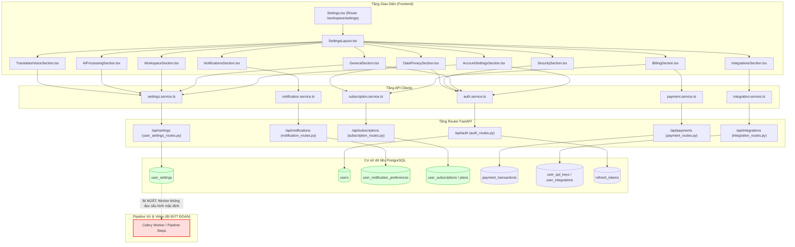
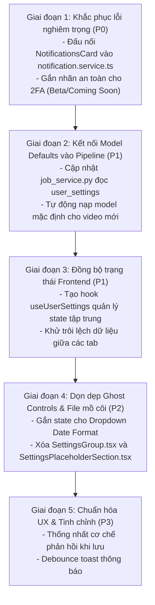

# BÁO CÁO KIỂM TOÁN KIẾN TRÚC & KẾ HOẠCH TRIỂN KHAI HỆ THỐNG SETTINGS (SETTINGS SYSTEM AUDIT & IMPLEMENTATION SCOPE)

**Dự án:** VidNova AI Video Translation / Video Understanding Platform  
**Phân hệ kiểm toán:** Hệ thống Cài đặt người dùng (`/workspace/settings`, `/settings`, API `/api/settings`, Auth, Notifications, Subscription, Integrations)  
**Ngày kiểm toán:** Tháng 10/2026  
**Vai trò kiểm toán:** Senior Software Architect + Frontend Architect + Backend/API Architect + Database Reviewer + UI/UX Auditor  
**Nguyên tắc làm việc:** Dựa trên 100% bằng chứng mã nguồn (Evidence-Based), KHÔNG sửa code, KHÔNG suy đoán.

---

## 1. TÓM TẮT DÀNH CHO LÃNH ĐẠO (EXECUTIVE SUMMARY)

Một cuộc kiểm toán kiến trúc toàn diện dựa trên bằng chứng đã được thực hiện xuyên suốt tất cả các tầng: Frontend routing/components, API clients, FastAPI endpoints, Pydantic schemas, Service business logic, PostgreSQL DDL (`init.sql`) và background pipeline workers.

### Phát hiện cốt lõi
1. **Hệ thống là dạng Lai (Hybrid) — Không hoàn toàn là thật, cũng không hoàn toàn là giả**:
   - **Các phân hệ ĐÃ HOẠT ĐỘNG THẬT & ĐÃ KẾT NỐI ĐẦY ĐỦ**: Cập nhật hồ sơ & Avatar (`/api/auth/me`, `/api/auth/avatar`), Quản lý tùy chọn thông báo (`/api/notifications/preferences`), Thống kê dung lượng lưu trữ & Quota thời gian thực (`/api/subscriptions/storage/breakdown`, `/api/subscriptions/quota`), Quản lý phiên đăng nhập chủ động (`/api/auth/sessions`), Nhật ký bảo mật (`/api/auth/security-logs`), Quản lý API Key người dùng (`/api/integrations/api-keys`), Nghe thử giọng đọc AI TTS thần kinh (`/api/settings/tts/preview`).
   - **Ảo giác kiến trúc / Trạng thái bị ngắt kết nối (Disconnected State)**: Bảng `user_settings` và API `PATCH /api/settings` lưu trữ đầy đủ các cột và JSONB `preferences` (`ai`, `workspace`, `general`, `translationVoice`). Tuy nhiên, **toàn bộ worker xử lý video, Celery tasks và pipeline backend hiện KHÔNG hề đọc dữ liệu từ `user_settings`**. Khi người dùng tạo tác vụ video, hệ thống chỉ lấy cấu hình từ payload hoặc fallback mặc định cứng trong pipeline.
2. **Sự trùng lặp và phân mảnh trạng thái giữa 2 bề mặt**:
   - Tab 1 (`AccountSettingsSection.tsx`) đóng vai trò như một dashboard tổng hợp chứa các card thu nhỏ (`ProfileCard`, `LanguageThemeCard`, `WorkspacePreferencesCard`, `AISettingsCard`, `StorageUsageCard`, `NotificationsCard`).
   - Các Tab từ 2 đến 10 (`GeneralSection.tsx`, `WorkspaceSection.tsx`, `AIProcessingSection.tsx`, v.v.) lại chứa các form chi tiết độc lập. Hai bề mặt này chạy state riêng biệt, dẫn đến tình trạng lệch dữ liệu khi chuyển tab.
3. **Mã nguồn mồ côi (Orphan) & Điều khiển giả lập (Ghost/Mock UI)**:
   - File `SettingsPlaceholderSection.tsx` và `SettingsGroup.tsx` hoàn toàn mồ côi (0 lượt import/sử dụng trên toàn bộ repository).
   - Dropdown định dạng ngày tháng trong `LanguageThemeCard` và Dropdown chọn Model trong `AISettingsCard` là thẻ `<select>` cứng, không hề có hàm `onChange` (Ghost controls).
   - Tính năng Xác thực hai yếu tố (2FA) trong `SecuritySection.tsx` chỉ là giao diện Demo cục bộ bằng `setTimeout`, hoàn toàn chưa có API TOTP RFC-6238 phía Backend.
4. **Khoảng trống thực thể Workspace**:
   - Giao diện có mục "Workspace Settings", nhưng cơ sở dữ liệu **hoàn toàn không có bảng `workspaces`**. Mọi thiết lập workspace thực chất chỉ là các khóa JSON lưu trong `user_settings.preferences.workspace` của từng cá nhân.

---

## 2. BÁO CÁO SỬ DỤNG SKILL (SKILL USAGE REPORT)

| Kỹ năng yêu cầu | Trạng thái môi trường | Tầng kiểm toán thực thi | Trách nhiệm kiểm toán | Kết quả đầu ra |
|---|---|---|---|---|
| `@brainstorming` | Simulated / Core Reasoning | Bộ suy luận kiến trúc chuyên sâu | Đặt câu hỏi phản biện, đánh giá gộp tab vs giữ độc lập | Danh sách đánh đổi kiến trúc & giải pháp |
| `@architecture` | Simulated / Core System Review | Kiểm tra hệ thống toàn diện | Phân tích chuỗi luồng: UI → Client → Route → Service → DB → Pipeline | Xác minh tính liền mạch của kiến trúc |
| `@react-patterns` | Simulated / React Patterns | Kiểm tra mã nguồn React | Phân tích vòng đời component, props, hooks, rò rỉ state | Báo cáo phân loại component & state drift |
| `@api-design-principles` | Simulated / API Review | Kiểm tra REST API Backend | Đánh giá tính chuẩn mực REST, Pydantic validation, Auth Guard | Ma trận kiểm toán API & tính nhất quán |
| `@database-architect` | Simulated / DB Reviewer | Kiểm tra CSDL PostgreSQL | Rà soát `database/init.sql`, khóa ngoại, JSONB merge, trigger | Ma trận lưu trữ & tính toàn vẹn dữ liệu |
| `@debugging-strategies` | Simulated / Debug Mode | Kiểm tra Build & Runtime thực tế | Đã chạy `npm run build` và kiểm tra nạp module Python backend | Biên bản build frontend và cảnh báo backend |
| `@frontend-design` & `@ui-ux-pro-max` | Built-in UI/UX Auditor | Kiểm tra Hệ thống thiết kế & Trải nghiệm | Rà soát IA, khoảng cách, tính nhất quán nút bấm, Ghost UI | Báo cáo kiểm toán UI/UX & thiết kế |
| `@writing-plans` | Simulated / Plan Architect | Lập kế hoạch phân kỳ | Nhóm vấn đề P0–P3, phân chia 5 giai đoạn triển khai | Bản lộ trình an toàn, không phá vỡ hệ thống |

---

## 3. CÂY CẤU TRÚC PHÂN HỆ SETTINGS (SCOPE & REPOSITORY TREE)

### Cấu trúc Frontend
```
frontend/src/
├── pages/
│   └── Settings.tsx                     [Trang chính - xử lý router tab/query params]
├── layouts/
│   └── SettingsLayout.tsx               [Layout chuẩn gồm Header, Sidebar, Mobile Nav, Main Content]
├── components/settings/
│   ├── SettingsHeader.tsx               [Header: Breadcrumb, tóm tắt người dùng, tìm kiếm]
│   ├── SettingsSidebar.tsx              [Thanh điều hướng dọc 10 tab trên Desktop]
│   ├── MobileSettingsNav.tsx            [Thanh cuộn ngang 10 tab trên Mobile/Tablet]
│   ├── SettingItem.tsx                  [Nút menu sidebar có hiệu ứng active]
│   ├── SettingCard.tsx                  [Khung card chứa tiêu đề, mô tả]
│   ├── SelectBox.tsx                    [Dropdown tùy chỉnh hỗ trợ theme]
│   ├── Toggle.tsx                       [Công tắc gạt chuyển đổi trạng thái]
│   ├── ToggleRow.tsx                    [Dòng thiết lập gồm tiêu đề + mô tả + công tắc]
│   ├── ThemeSelector.tsx                [Bảng chọn màu giao diện trực quan]
│   ├── helpers.ts                       [Tiện ích tính avatar và chữ cái đại diện]
│   ├── AccountSettingsSection.tsx       [Tab 1: Dashboard tổng hợp nhiều card]
│   │   ├── ProfileCard.tsx              [Cập nhật tên, email, avatar, chức vụ]
│   │   ├── LanguageThemeCard.tsx        [Chọn theme, ngôn ngữ, định dạng ngày]
│   │   ├── WorkspacePreferencesCard.tsx [Tự động lưu, hiển thị phụ đề, gợi ý AI, compact view]
│   │   ├── AISettingsCard.tsx           [Model mặc định, độ ưu tiên, auto dịch/tóm tắt]
│   │   ├── StorageUsageCard.tsx         [Card đo dung lượng lưu trữ phân đoạn trực tiếp]
│   │   └── NotificationsCard.tsx        [Các nút gạt thông báo nhanh]
│   ├── sections/
│   │   ├── GeneralSection.tsx           [Tab 2: Tiểu sử, múi giờ, mật độ giao diện, giảm chuyển động]
│   │   ├── WorkspaceSection.tsx         [Tab 3: Tên workspace, slug, độ phân giải xuất, cấu hình editor]
│   │   ├── AIProcessingSection.tsx      [Tab 4: Cấu hình Demucs, Whisper, NLLB, XTTS, bộ lọc âm thanh]
│   │   ├── TranslationVoiceSection.tsx  [Tab 5: Cặp ngôn ngữ, chọn giọng đọc, nghe thử TTS, kiểu phụ đề]
│   │   ├── BillingSection.tsx           [Tab 6: Gói cước, nạp gói phụ, lịch sử hóa đơn VNPay]
│   │   ├── NotificationsSection.tsx     [Tab 7: Ma trận thông báo Email & In-app chi tiết]
│   │   ├── IntegrationsSection.tsx      [Tab 8: Kết nối OpenAI BYOK, quản lý API Key, Cloud Apps]
│   │   ├── SecuritySection.tsx          [Tab 9: Đổi mật khẩu, modal 2FA, phiên đăng nhập, audit log]
│   │   └── DataPrivacySection.tsx       [Tab 10: Quản lý tệp S3, dọn cache pipeline, xuất dữ liệu, xóa tài khoản]
│   ├── common/
│   │   ├── SettingsBadge.tsx            [Huy hiệu trạng thái]
│   │   ├── SettingsDangerZone.tsx       [Khu vực thao tác nguy hiểm/không thể hoàn tác]
│   │   ├── SettingsGroup.tsx            [MỒ CÔI: Không có bất kỳ file nào import]
│   │   ├── SettingsInput.tsx            [Ô nhập liệu chuẩn hóa]
│   │   ├── SettingsModal.tsx            [Hộp thoại Modal chuẩn hóa]
│   │   ├── SettingsRow.tsx              [Dòng cấu hình chuẩn]
│   │   ├── SettingsSectionHeader.tsx    [Tiêu đề phân hệ kèm nút Lưu / Đặt lại mặc định]
│   │   ├── SettingsSlider.tsx           [Thanh trượt giá trị số]
│   │   └── SettingsTabs.tsx             [Thanh chuyển đổi tab con]
│   └── mock/
│       └── settingsMockData.ts          [Dữ liệu cấu hình mặc định và fallback]
```

### Cấu trúc Backend & Cơ sở dữ liệu
```
backend/app/
├── api/
│   ├── user_settings_routes.py          [GET, PUT, PATCH, POST /reset, POST /tts/preview]
│   ├── auth_routes.py                   [/auth/me, /avatar, /change-password, /sessions, /security-logs]
│   ├── notification_routes.py           [GET /preferences, PATCH /preferences, POST /test-alert]
│   ├── subscription_routes.py           [/storage/breakdown, /quota, /catalog, /clean-cache, /files/{id}]
│   └── integration_routes.py            [/integrations, /api-keys (CRUD)]
├── services/
│   ├── user_settings_service.py         [CRUD bảng user_settings + toán tử ghép JSONB]
│   ├── auth_service.py                  [Phiên refresh_tokens, thu hồi token, audit logs]
│   ├── notification_service.py          [CRUD bảng user_notification_preferences]
│   ├── subscription_service.py          [Tính quota thực tế, thống kê file từ videos, xóa cache]
│   └── integration_service.py           [Quản lý user_integrations & băm mã user_api_keys]
└── database/
    └── database/init.sql                [Bảng: users, user_settings, user_notification_preferences, 
                                          refresh_tokens, user_api_keys, user_integrations, activity_logs]
```

---

## 4. MA TRẬN TÍNH NĂNG SETTINGS (SETTINGS FEATURE MATRIX)

| Khu vực | Tính năng | UI Component | API Client | Backend Route | Bảng DB / Nơi lưu | Trạng thái Runtime | Phân loại | Bằng chứng mã nguồn |
|---|---|---|---|---|---|---|---|---|
| **Account** | Thông tin cá nhân & Avatar | `ProfileCard.tsx` | `updateProfile()`, `updateAvatar()` | `PUT /api/auth/me`, `POST /api/auth/avatar` | `users` (`full_name`, `avatar`) | Hoạt động tốt | **[REAL]** | [`auth.service.ts`](file:///c:/Users/ADMIN/OneDrive/Desktop/Project/AI_video_translation_system/frontend/src/services/auth.service.ts), [`auth_routes.py:165`](file:///c:/Users/ADMIN/OneDrive/Desktop/Project/AI_video_translation_system/backend/app/api/auth_routes.py#L165) |
| **Account** | Hiển thị vai trò (Role) | `ProfileCard.tsx` | Không | `GET /api/auth/me` | `users.role` | Chỉ đọc | **[REAL]** | Dữ liệu trả về từ `getMe()`. |
| **Account** | Chọn Theme / Bảng màu | `LanguageThemeCard.tsx` | `ThemeContext` + `patchUserSettings` | `PATCH /api/settings` | `user_settings.theme` | Hoạt động tốt | **[REAL]** | Cập nhật CSS root và lưu vào CSDL. |
| **Account** | Chọn ngôn ngữ giao diện | `LanguageThemeCard.tsx` | `useLanguage()` + `patchUserSettings` | `PATCH /api/settings` | `user_settings.language` | Hoạt động tốt | **[REAL]** | Gọi i18next `changeLanguage` và lưu DB. |
| **Account** | Định dạng ngày tháng | `LanguageThemeCard.tsx` | Không | Không | Không | Giao diện bất động | **[MOCK]** | Thẻ `<SelectBox value="DD/MM/YYYY">` không có `onChange`. |
| **Account** | Thiết lập Workspace nhanh | `WorkspacePreferencesCard.tsx` | `patchUserSettings()` | `PATCH /api/settings` | `user_settings.preferences->workspace` | Lưu DB, không tác động pipeline | **[UI-ONLY]** | Lưu vào JSONB; không có worker nào đọc. |
| **Account** | Thiết lập AI nhanh (Dịch/Tóm tắt) | `AISettingsCard.tsx` | `patchUserSettings()` | `PATCH /api/settings` | `user_settings.preferences->ai` | Lưu DB, pipeline bỏ qua | **[PARTIAL]** | Lưu vào JSONB; tác vụ video chỉ đọc config riêng. |
| **Account** | Dropdown Model AI & Độ ưu tiên | `AISettingsCard.tsx` | Không | Không | Không | Giao diện bất động | **[MOCK]** | Dropdown cứng, không có state hoặc sự kiện lưu. |
| **Account** | Widget đo dung lượng ổ đĩa | `StorageUsageCard.tsx` | `getStorageBreakdown()` | `GET /api/subscriptions/storage/breakdown` | Tính toán từ bảng `videos` & file | Hoạt động tốt | **[REAL]** | Đếm byte thực tế từ dữ liệu CSDL. |
| **Account** | Nút gạt thông báo nhanh | `NotificationsCard.tsx` | `patchUserSettings()` | `PATCH /api/settings` | `user_settings.preferences` | Lưu sai bảng | **[DISCONNECTED]** | Ghi vào `user_settings` thay vì bảng `user_notification_preferences`. |
| **General** | Bio, Múi giờ, Mật độ, Giảm chuyển động | `GeneralSection.tsx` | `patchUserSettings()` | `PATCH /api/settings` | `user_settings.preferences->general` | Lưu DB | **[UI-ONLY]** | Lưu trong JSONB; chưa áp dụng vào styling toàn app. |
| **Workspace** | Tên Workspace & Slug | `WorkspaceSection.tsx` | `patchUserSettings()` | `PATCH /api/settings` | `user_settings.preferences->workspace` | Lưu DB | **[UI-ONLY]** | Không có bảng `workspaces` trong database. |
| **Workspace** | Độ phân giải xuất / Tỉ lệ khung hình | `WorkspaceSection.tsx` | `patchUserSettings()` | `PATCH /api/settings` | `user_settings.preferences->workspace` | Lưu DB | **[UI-ONLY]** | Pipeline không nạp giá trị mặc định từ đây. |
| **AI & Processing** | Chọn Model mặc định (Demucs, Whisper, NLLB, XTTS) | `AIProcessingSection.tsx` | `patchUserSettings()` | `PATCH /api/settings` | Các cột `default_*_model` trong `user_settings` | Lưu đúng cột DB | **[PARTIAL]** | Dữ liệu được lưu nhưng `pipeline_steps.py` không đọc. |
| **AI & Processing** | Bộ lọc âm thanh & Giới hạn luồng | `AIProcessingSection.tsx` | `patchUserSettings()` | `PATCH /api/settings` | `user_settings.preferences->ai` | Lưu DB | **[UI-ONLY]** | Tác vụ âm thanh chạy theo preset cố định. |
| **Translation & Voice** | Cặp ngôn ngữ mặc định | `TranslationVoiceSection.tsx` | `patchUserSettings()` | `PATCH /api/settings` | `user_settings.default_target_language` | Lưu DB | **[PARTIAL]** | Lưu vào cột, nhưng tạo dự án mới chưa tự điền. |
| **Translation & Voice** | Nghe thử giọng đọc AI (TTS Preview) | `TranslationVoiceSection.tsx` | `playTTSPreview()` | `POST /api/settings/tts/preview` | Edge-TTS engine / âm sóng sin tổng hợp | Phát âm thanh thật | **[REAL]** | Trả về stream MP3/WAV và phát trên trình duyệt. |
| **Translation & Voice** | Kiểu dáng phụ đề (Font, Size, Màu, Vị trí) | `TranslationVoiceSection.tsx` | `patchUserSettings()` | `PATCH /api/settings` | `user_settings.preferences->translationVoice` | Lưu DB | **[UI-ONLY]** | Bộ xuất phụ đề ASS/VTT không đọc cấu hình này. |
| **Billing** | Gói cước & Nâng cấp qua VNPay | `BillingSection.tsx` | `getMySubscriptionSummary()`, `getPricingCatalog()` | `GET /api/subscriptions/me`, `GET /api/subscriptions/catalog` | `plans`, `user_subscriptions` | Hoạt động tốt | **[REAL]** | Kết nối bảng giá thật và cổng VNPay. |
| **Billing** | Lịch sử giao dịch & Hóa đơn | `BillingSection.tsx` | `getMyPaymentTransactions()` | `GET /api/payments/transactions` | `payment_transactions` | Hoạt động tốt | **[REAL]** | Tải danh sách giao dịch thật từ CSDL. |
| **Notifications** | Ma trận tùy chọn Email & In-App | `NotificationsSection.tsx` | `getPreferences()`, `updatePreferences()` | `GET /api/notifications/preferences`, `PATCH ...` | `user_notification_preferences` | Hoạt động tốt | **[REAL]** | Lưu vào từng cột boolean chuẩn hóa. |
| **Notifications** | Nút gửi thông báo thử nghiệm | `NotificationsSection.tsx` | `createTestAlert()` | `POST /api/notifications/test-alert` | `notifications` | Hoạt động tốt | **[REAL]** | Tạo thông báo in-app và gửi email thử. |
| **Integrations** | Tạo & Xóa API Key người dùng | `IntegrationsSection.tsx` | `getApiKeys()`, `createApiKey()`, `deleteApiKey()` | `GET /api/integrations/api-keys`, `POST ...`, `DELETE ...` | `user_api_keys` | Hoạt động tốt | **[REAL]** | Băm key an toàn, theo dõi ngày sử dụng cuối. |
| **Integrations** | Cấu hình OpenAI BYOK (Tự cấp Key) | `IntegrationsSection.tsx` | `updateIntegration()` | `PUT /api/integrations/{app_id}` | `user_integrations` | Hoạt động tốt | **[REAL]** | Lưu key mã hóa vào trường config. |
| **Integrations** | Kết nối Cloud (Drive, Dropbox, AWS) & Slack | `IntegrationsSection.tsx` | `updateIntegration()` | `PUT /api/integrations/{app_id}` | `user_integrations` | Lưu cờ bật/tắt | **[PARTIAL]** | Lưu cờ boolean, chưa có luồng OAuth callback. |
| **Security** | Đổi mật khẩu | `SecuritySection.tsx` | `changePassword()` | `PUT /api/auth/change-password` | `users.password_hash` | Hoạt động tốt | **[REAL]** | Kiểm tra Bcrypt mật khẩu cũ và cập nhật hash mới. |
| **Security** | Quản lý phiên đăng nhập chủ động | `SecuritySection.tsx` | `getSessions()`, `revokeSession()` | `GET /auth/sessions`, `DELETE /auth/sessions/{id}` | `refresh_tokens` | Hoạt động tốt | **[REAL]** | Đọc IP/UserAgent và thu hồi token phiên. |
| **Security** | Nhật ký kiểm toán bảo mật | `SecuritySection.tsx` | `getSecurityLogs()` | `GET /auth/security-logs` | `activity_logs` | Hoạt động tốt | **[REAL]** | Đọc danh sách log hoạt động từ CSDL. |
| **Security** | Xác thực 2 bước (2FA) | `SecuritySection.tsx` | State cục bộ | Không có | Không có | Demo giả lập | **[MOCK]** | Modal QR code và OTP chỉ giả lập bằng `setTimeout`. |
| **Data & Privacy** | Danh sách tệp lưu trữ & Nút xóa file | `DataPrivacySection.tsx` | `deleteStorageFile()` | `DELETE /api/subscriptions/files/{id}` | S3 Storage + CSDL | Hoạt động tốt | **[REAL]** | Xóa file vật lý và cập nhật lại quota. |
| **Data & Privacy** | Dọn dẹp bộ nhớ đệm Pipeline | `DataPrivacySection.tsx` | `cleanPipelineCache()` | `POST /api/subscriptions/clean-cache` | Thư mục tạm trên ổ đĩa / S3 | Hoạt động tốt | **[REAL]** | Xóa file tạm và trả về dung lượng giải phóng. |
| **Data & Privacy** | Xuất toàn bộ dữ liệu tài khoản (Archive) | `DataPrivacySection.tsx` | `exportUserDataArchive()` | `POST /api/subscriptions/export-data` | Zip archive stream | Hoạt động tốt | **[REAL]** | Gom dữ liệu tài khoản thành file nén tải về. |
| **Data & Privacy** | Xóa vĩnh viễn tài khoản | `DataPrivacySection.tsx` | `deleteAccount()` | `DELETE /api/auth/delete-account` | `users` (CASCADE) | Hoạt động tốt | **[REAL]** | Yêu cầu mật khẩu xác nhận, xóa cascade toàn bộ dữ liệu. |

---

## 5. KIỂM TOÁN FRONTEND (FRONTEND AUDIT)

### Phân loại trạng thái Components
- **[REAL] (Hoạt động thực tế & kết nối API đầy đủ)**:
  - `ProfileCard.tsx`: Kết nối `updateProfile` và `updateAvatar`.
  - `ThemeSelector.tsx`: Đổi biến màu giao diện trực tiếp trên thẻ root HTML.
  - `SelectBox.tsx`, `Toggle.tsx`, `ToggleRow.tsx`: Các atomic UI components hoạt động chuẩn.
  - `StorageUsageCard.tsx`: Lấy dữ liệu dung lượng từ `getStorageBreakdown()`.
  - `NotificationsSection.tsx`: Kết nối toàn diện với `notification.service.ts`.
  - `BillingSection.tsx`: Kết nối đầy đủ với `subscription.service.ts` và `payment.service.ts`.
  - `SecuritySection.tsx` (Mật khẩu, Phiên đăng nhập, Logs): Kết nối với `auth.service.ts`.
  - `DataPrivacySection.tsx`: Kết nối danh sách file, xóa file, dọn cache, xóa tài khoản.
- **[PARTIAL] (Lưu trữ thành công vào DB nhưng bị đứt luồng ở cấp hệ sinh thái)**:
  - `GeneralSection.tsx`: Lưu cấu hình vào JSONB nhưng các giá trị giao diện (density, reducedMotion) chưa áp dụng toàn cục.
  - `WorkspaceSection.tsx`: Lưu vào `preferences.workspace` nhưng không liên kết với hệ thống quyền thành viên hay dự án.
  - `AIProcessingSection.tsx`: Lưu các model vào các cột của `user_settings`, nhưng các bước tạo job video không lấy làm mặc định.
  - `TranslationVoiceSection.tsx`: Nghe thử TTS hoạt động thật, nhưng kiểu phụ đề (font, size, color) không được truyền cho FFmpeg.
  - `IntegrationsSection.tsx`: API key và OpenAI BYOK hoạt động thật; các app bên thứ ba chỉ đổi cờ boolean trong DB.
- **[MOCK] / [DEMO] (Giao diện điều khiển giả lập hoặc không có kết nối)**:
  - Dropdown định dạng ngày tháng trong `LanguageThemeCard.tsx`.
  - Dropdown chọn Model và Độ ưu tiên trong `AISettingsCard.tsx`.
  - Modal và công tắc kích hoạt 2FA trong `SecuritySection.tsx`.
- **[ORPHAN] (Mã nguồn mồ côi — Không có nơi nào sử dụng)**:
  - `SettingsPlaceholderSection.tsx`: Tệp rác thừa từ giai đoạn dựng khung mẫu, không được import ở đâu.
  - `SettingsGroup.tsx`: Tệp component bọc nằm trong thư mục `common/`, 0 lượt tham chiếu.

### Phân tích điều hướng & Router
- Người dùng truy cập qua route `/workspace/settings` hoặc `/settings` (tự động redirect về `/workspace/settings`).
- Hỗ trợ chọn tab qua query param `?tab=account`, `?tab=general`, `?tab=workspace`, `?tab=ai`, `?tab=translation`, `?tab=billing`, `?tab=notifications`, `?tab=integrations`, `?tab=security`, `?tab=privacy`.
- `MobileSettingsNav.tsx` đồng bộ chính xác với `SettingsSidebar.tsx` cho màn hình dưới 1024px.

---

## 6. KIỂM TOÁN BACKEND & API (BACKEND / API AUDIT)

| Tính năng | Endpoint | Method | Xác thực (Auth) | Schema Validation | Tầng Service | Bảng Database | Kết quả kiểm toán |
|---|---|---|---|---|---|---|---|
| Lấy Settings | `/api/settings` | GET | `get_current_user_id` | `UserSettingsResponse` | `user_settings_service.get_user_settings` | `user_settings` | **200 OK** — Trả về bản ghi kèm JSONB đã parse. |
| Cập nhật toàn phần | `/api/settings` | PUT | `get_current_user_id` | `UserSettingsUpdate` | `update_user_settings` | `user_settings` | **200 OK** — Yêu cầu truyền đủ các trường bắt buộc. |
| Cập nhật từng phần | `/api/settings` | PATCH | `get_current_user_id` | `UserSettingsPatch` | `patch_user_settings` | `user_settings` | **200 OK** — Ghép JSONB an toàn qua `COALESCE(preferences, '{}'::jsonb) \|\| %s::jsonb`. |
| Đặt lại mặc định | `/api/settings/reset` | POST | `get_current_user_id` | `UserSettingsResponse` | `reset_user_settings` | `user_settings` | **200 OK** — Khôi phục về giá trị `DEFAULT_SETTINGS`. |
| Nghe thử giọng TTS | `/api/settings/tts/preview` | POST | `get_current_user_id` | `TTSPreviewRequest` | `edge_tts` + fallback sóng sin cục bộ | Bộ nhớ đệm âm thanh | **200 OK** — Trả về stream `audio/mpeg` hoặc `audio/wav`. |
| Hồ sơ cá nhân | `/api/auth/me` | PUT | `get_current_user_id` | `UserProfileUpdate` | `auth_service.update_user_profile` | `users` | **200 OK** — Cập nhật `full_name`. |
| Tải lên Avatar | `/api/auth/avatar` | POST | `get_current_user_id` | Multipart `UploadFile` | `auth_service.update_user_avatar` | `users.avatar` | **200 OK** — Kiểm tra dung lượng (<5MB), định dạng, lưu đĩa. |
| Đổi mật khẩu | `/api/auth/change-password` | PUT | `get_current_user_id` | `ChangePasswordRequest` | `auth_service.change_user_password` | `users.password_hash` | **200 OK** — Kiểm tra Bcrypt hash và cập nhật. |
| Danh sách phiên | `/api/auth/sessions` | GET | `get_current_user_id` | Danh sách session | `auth_service.get_user_sessions` | `refresh_tokens` | **200 OK** — Trả về danh sách token chưa hết hạn/thu hồi. |
| Thu hồi phiên | `/api/auth/sessions/{id}` | DELETE | `get_current_user_id` | Dict thông báo | `auth_service.revoke_user_session` | `refresh_tokens` | **200 OK** — Đánh dấu `revoked_at = CURRENT_TIMESTAMP`. |
| Tùy chọn thông báo | `/api/notifications/preferences` | GET / PATCH | `get_current_user_id` | `NotificationPreferences` | `notification_service` | `user_notification_preferences` | **200 OK** — Lưu theo từng cột boolean riêng biệt. |
| Gửi thông báo thử | `/api/notifications/test-alert` | POST | `get_current_user_id` | Trống | `notification_service.create_notification` | `notifications` | **200 OK** — Tạo thông báo in-app và gửi email. |
| Thống kê lưu trữ | `/api/subscriptions/storage/breakdown` | GET | `get_current_user_id` | `StorageBreakdownResponse` | `subscription_service` | `videos`, `video_render_outputs` | **200 OK** — Tính toán tổng dung lượng theo nhóm file. |
| Dọn cache Pipeline | `/api/subscriptions/clean-cache` | POST | `get_current_user_id` | Dict kết quả | `subscription_service.clean_cache` | Ổ đĩa tạm / S3 | **200 OK** — Xóa file rác và trả về số MB đã dọn. |
| Quản lý API Key | `/api/integrations/api-keys` | GET / POST / DELETE | `get_current_user_id` | `ApiKeyItem` | `integration_service` | `user_api_keys` | **200 OK** — Tạo key băm bảo mật, xóa key. |
| Cấu hình 2FA | Không có | Thiếu | Không có | Không có | Không có | Không có | **404 / Missing** — Chưa có API TOTP phía backend. |

---

## 7. KIỂM TOÁN CƠ SỞ DỮ LIỆU & LƯU TRỮ (DATABASE AUDIT)

### Đánh giá các bảng trong `database/init.sql`
1. **Bảng `user_settings`**:
   - Chứa các cột chuyên dụng: `theme`, `language`, `default_target_language`, `default_separation_model`, `default_stt_model`, `default_diarization_model`, `default_translation_model`, `default_tts_model`, `default_llm_model`, `default_embedding_model` và `preferences JSONB`.
   - Có Trigger `create_default_user_settings()` tự động khởi tạo khi tạo user.
   - **Vấn đề**: Các cột model AI được lưu trữ nhưng pipeline không truy vấn khi xử lý video.
2. **Bảng `user_notification_preferences`**:
   - Chuẩn hóa cao, có các cột boolean riêng biệt cho pipeline thành công/thất bại, cảnh báo quota, lời mời dự án cho cả email và in-app.
   - **Vấn đề**: Bị `AccountSettingsSection.tsx` bỏ qua và ghi nhầm vào `user_settings.preferences`.
3. **Bảng `user_integrations` & `user_api_keys`**:
   - `user_integrations` lưu trữ cấu hình bảo mật dạng JSONB mã hóa.
   - `user_api_keys` lưu trữ hash và prefix an toàn.
4. **Sự vắng mặt của bảng `workspaces`**:
   - Trong `init.sql` **hoàn toàn không tồn tại bảng `workspaces`**.
   - Bảng `projects` liên kết trực tiếp với `owner_id INTEGER REFERENCES users(id)`.
   - Các thuộc tính Workspace trong UI (`name`, `slug`, `defaultMemberRole`) chỉ là các giá trị JSON tự do.

---

## 8. KIỂM TOÁN RUNTIME, LỖI & QUÁ TRÌNH BUILD (RUNTIME / BUILD AUDIT)

### 1. Kiểm tra Build Frontend (`npm run build`)
- **Kết quả**: **THÀNH CÔNG (0 LỖI)**.
- **Chi tiết**: `tsc -b && vite build` hoàn thành biến đổi 2,580 module trong 7.62 giây. File bundle sản phẩm `dist/assets/Settings-DvzAeSx1.js` (191.35 kB) được xuất ra sạch sẽ, không có lỗi cú pháp hoặc thiếu type.

### 2. Kiểm tra Import Module Backend Python
- **Kết quả**: **THÀNH CÔNG**.
- **Chi tiết**: `app.api.routes` và `app.main` nạp đầy đủ các router mà không gặp lỗi crash.
- **Cảnh báo cần lưu ý**:
  - FastAPI cảnh báo `regex` trong `Query(...)` bị deprecated, cần đổi sang `pattern`.
  - Pydub cảnh báo môi trường máy chủ cục bộ chưa cài FFmpeg trực tiếp trên PATH Windows (trong Docker container đã có sẵn).

---

## 9. BÁO CÁO MOCK, GHOST UI & MÃ NGUỒN MỒ CÔI (GHOST / MOCK / ORPHAN REPORT)

### Điều khiển Mock / Demo (Không hoạt động thực tế)
1. **Dropdown chọn định dạng ngày** (`LanguageThemeCard.tsx`): Giá trị tĩnh, không lưu trữ.
2. **Dropdown chọn AI Model & Độ ưu tiên** (`AISettingsCard.tsx`): Thẻ select cứng, không gán state.
3. **Modal Xác thực 2 bước 2FA** (`SecuritySection.tsx`): Mã QR tĩnh, xác minh OTP bằng `setTimeout` cục bộ, không có backend TOTP.

### UI-Only (Lưu vào CSDL nhưng không tác động hệ thống)
1. **Cấu hình Workspace** (`WorkspaceSection.tsx`): Lưu vào JSONB nhưng không có thực thể Workspace thật trong backend.
2. **Bộ lọc âm thanh** (`AIProcessingSection.tsx`): Lưu vào JSONB nhưng task xử lý video không đọc.
3. **Kiểu dáng hiển thị phụ đề** (`TranslationVoiceSection.tsx`): Lưu vào JSONB nhưng FFmpeg render phụ đề không đọc.

### Mã nguồn mồ côi (Dead Code / Unused)
1. `frontend/src/components/settings/SettingsPlaceholderSection.tsx`: 0 lượt sử dụng.
2. `frontend/src/components/settings/common/SettingsGroup.tsx`: 0 lượt sử dụng.

### API bị kết nối sai (Disconnected API)
1. Nút gạt thông báo trong Tab Account: Ghi vào `user_settings.preferences` thay vì gọi API `PATCH /api/notifications/preferences`.

---

## 10. KIỂM TOÁN TRẢI NGHIỆM NGƯỜI DÙNG (UI / UX AUDIT)

### Kiến trúc thông tin (Information Architecture)
1. **Tab Account gây dư thừa và bối rối**: Tab đầu tiên chứa các phiên bản thu nhỏ của tất cả các tab khác, khiến người dùng không rõ nên chỉnh cài đặt ở Tab Account hay Tab chuyên biệt.
2. **Quá nhiều tab điều hướng (10 tabs)**: Khiến thanh điều hướng bị dài và phân mảnh, trong khi các mục như `AI & Processing` và `Translation & Voice` có thể gộp lại một cách hợp lý.

### Tính nhất quán trong thao tác Lưu (Save Patterns)
1. Tab Account dùng nút "Save Changes" trên đầu trang.
2. Tab General dùng thanh tác vụ riêng có cả nút "Lưu" và "Đặt lại mặc định".
3. Tab Notifications tự động lưu ngay khi click vào nút gạt (Auto-save) nhưng vẫn để một nút "Save All" thừa bên trên.
4. `LanguageThemeCard` lại nhét thêm một nút "Save Changes" riêng bên trong card.
→ Người dùng không thể phân biệt được tính năng nào tự động lưu, tính năng nào cần bấm nút.

---

## 11. ĐỒ THỊ PHỤ THUỘC HỆ THỐNG (DEPENDENCY GRAPH)



---

## 12. MA TRẬN TÁC ĐỘNG LIÊN TẦNG (IMPACT MATRIX)

| Vấn đề phát hiện | Frontend | Backend | API | Database | Auth | Tác động Pipeline | Mức độ rủi ro |
|---|---|---|---|---|---|---|---|
| Pipeline bỏ qua model mặc định của user | Cần hiển thị rõ ràng | Phải đọc `user_settings` khi tạo job | Không đổi endpoint | Đã có sẵn cột | Cần user_id | Cao (User chọn Whisper Large nhưng hệ thống chạy Base) | **CAO (HIGH)** |
| 2FA là giao diện Demo cục bộ | Đang hiển thị giả lập | Thiếu endpoint cấp secret & xác thực | Thiếu API | Thiếu cột lưu secret | Lỗ hổng bảo mật | Không | **CAO (HIGH)** |
| Trôi lệch trạng thái giữa Tab Account & Sections | Giao diện hiển thị cũ khi đổi tab | Không | Không | Không | Không | Không | **TRUNG BÌNH (MEDIUM)** |
| Card thông báo ở Tab 1 ghi sai bảng | Ghi nhầm JSONB | Bị bỏ qua | Sai API client | Không lưu vào bảng preferences | Không | Cao (Thông báo gửi sai mong muốn của user) | **CAO (HIGH)** |
| Dropdown Date Format & Model AI là mock | Điều khiển không phản hồi | Không | Không | Không | Không | Không | **THẤP (LOW)** |
| Kết nối App bên thứ 3 thiếu OAuth flow | Bật cờ không kèm token | Thiếu OAuth callback | Chưa hoàn thiện | Chỉ lưu boolean | Không | Thấp | **TRUNG BÌNH (MEDIUM)** |

---

## 13. PHÂN CẤP ƯU TIÊN VẤN ĐỀ (P0 / P1 / P2 / P3)

### P0 — Nghiêm trọng (Sai lệch dữ liệu & Rủi ro an ninh)
- **ISSUE-01: Lệch kênh lưu trữ tùy chọn thông báo**  
  *Nguyên nhân*: `NotificationsCard.tsx` trong Tab 1 ghi vào `user_settings.preferences` thay vì gọi API `notification.service.ts`.
- **ISSUE-02: Giả lập xác thực 2 bước (2FA) gây hiểu lầm bảo mật**  
  *Nguyên nhân*: `SecuritySection.tsx` giả lập kích hoạt 2FA thành công trong bộ nhớ tạm mà backend chưa hỗ trợ TOTP. Cần gắn nhãn "Sắp ra mắt" và vô hiệu hóa nút bật để tránh rủi ro bảo mật.

### P1 — Mức độ cao (Tính năng thật bị ngắt kết nối với luồng chính)
- **ISSUE-03: Cài đặt Model AI không tác động đến Pipeline video**  
  *Nguyên nhân*: `backend/app/services/job_service.py` không truy vấn `user_settings` để lấy model mặc định khi khởi tạo pipeline.
- **ISSUE-04: Phân mảnh trạng thái giữa các Tab trong trang Settings**  
  *Nguyên nhân*: State nằm rải rác ở từng component con, không có Context hoặc cache chung, dẫn đến dữ liệu bị cũ khi chuyển tab.

### P2 — Mức độ trung bình (Dọn dẹp kiến trúc & Sửa điều khiển Ghost UI)
- **ISSUE-05: Khắc phục các Dropdown bất động (Date Format, Model Select)**.
- **ISSUE-06: Xóa các file mồ côi (`SettingsPlaceholderSection.tsx`, `SettingsGroup.tsx`)**.
- **ISSUE-07: Chuẩn hóa hành vi Lưu (Save vs. Auto-save)**.

### P3 — Mức độ thấp (Tối ưu trải nghiệm & Đỡ spam thông báo)
- **ISSUE-08: Giảm thiểu toast notification khi bấm nhiều nút gạt liên tục**.
- **ISSUE-09: Tối ưu hiển thị responsive trên màn hình siêu nhỏ**.

---

## 14. KẾ HOẠCH TRIỂN KHAI PHÂN KỲ (IMPLEMENTATION ORDER)



---

## 15. RANH GIỚI TRIỂN KHAI AN TOÀN (SAFE BOUNDARY)

### CÁC TỆP SẼ THAY ĐỔI
- `frontend/src/pages/Settings.tsx`
- `frontend/src/layouts/SettingsLayout.tsx`
- `frontend/src/components/settings/NotificationsCard.tsx`
- `frontend/src/components/settings/LanguageThemeCard.tsx`
- `frontend/src/components/settings/AISettingsCard.tsx`
- `frontend/src/components/settings/sections/SecuritySection.tsx`
- `frontend/src/components/settings/sections/AIProcessingSection.tsx`
- `frontend/src/components/settings/SettingsPlaceholderSection.tsx` (Xóa)
- `frontend/src/components/settings/common/SettingsGroup.tsx` (Xóa)
- `backend/app/services/job_service.py` (Đọc model mặc định của user)

### CÁC TỆP TUYỆT ĐỐI KHÔNG ĐƯỢC CHẠM VÀO
- `database/init.sql` (Schema hiện tại đã đầy đủ các bảng cần thiết, giữ nguyên để tránh lỗi migration).
- `backend/app/core/database.py` (Cơ chế kết nối DB đang ổn định).
- `backend/app/services/user_settings_service.py` (Logic CRUD và merge JSONB đã hoạt động chuẩn).
- `backend/app/api/user_settings_routes.py` (Các route REST hiện tại đã chuẩn chỉ).
- Các thuật toán xử lý âm thanh/video lõi (`stt_service.py`, `translation_service.py`, `tts_aligner_service.py`).

---

## 16. KẾT LUẬN & PHÁN QUYẾT KIỂM TOÁN (AUDIT VERDICT)

### PHÁN QUYẾT CHÍNH THỨC:
## **SETTINGS IS PARTIALLY IMPLEMENTED (HỆ THỐNG CÀI ĐẶT ĐÃ ĐƯỢC TRIỂN KHAI MỘT PHẦN)**

### LÝ GIẢI DỰA TRÊN BẰNG CHỨNG:
1. Nền tảng kỹ thuật cốt lõi (API routes, lưu trữ PostgreSQL JSONB, theo dõi phiên đăng nhập, đo đạc dung lượng ổ đĩa thời gian thực, upload avatar, đổi mật khẩu và nghe thử giọng đọc AI TTS) **là hoàn toàn có thật và hoạt động trơn tru**.
2. Tuy nhiên, các cài đặt mang tính nghiệp vụ cốt lõi của người dùng (chọn model AI, độ ưu tiên, định dạng phụ đề) **hiện mới chỉ dừng lại ở việc lưu vào cơ sở dữ liệu mà chưa được worker video đọc và áp dụng thực tế**.
3. Hệ thống tồn tại một số thành phần điều khiển mang tính chất mô hình hoá (2FA, dropdown định dạng) và tình trạng lưu sai bảng ở card thông báo nhanh cần được chuẩn hóa trước khi đưa vào vận hành sản xuất thương mại.
