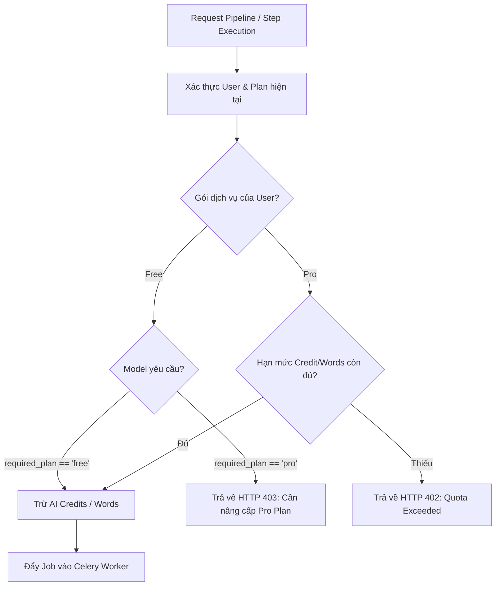

# TÀI LIỆU CHI TIẾT: HỆ THỐNG GÓI DỊCH VỤ 2 TẦNG (FREE & PRO) VÀ QUY CHUẨN TÀI NGUYÊN

## 1. TỔNG QUAN VÀ MỤC TIÊU KIẾN TRÚC

Hệ thống **AI Video Translation & Video Understanding Platform** (VidNova) đã được tái cấu trúc từ mô hình 3 gói (`Free`, `Pro`, `Business`) sang **mô hình 2 tầng tinh gọn (2-Tier Subscription Model)**:
1. **Free Plan (Gói Miễn Phí)**: Dành cho người dùng trải nghiệm nền tảng, thử nghiệm pipeline AI với hạn mức an toàn, độ phân giải tối đa 720p và 1 job xử lý đồng thời.
2. **Pro Plan (Gói Chuyên Nghiệp)**: Mở khóa trọn bộ năng lực cao cấp cho cá nhân, nhà sáng tạo nội dung, studio nhỏ: xử lý batch, dung lượng lưu trữ lớn (100 GB), upload 4K, thời lượng video lên tới 4 giờ, 3 job xử lý đồng thời, ưu tiên hàng đợi (priority queue), và toàn quyền sử dụng tất cả các mô hình AI cao cấp.

Việc loại bỏ Business plan giúp:
- Tinh giản cấu trúc giá và trang thanh toán người dùng (chỉ còn 2 thẻ so sánh rõ ràng, tập trung tỷ lệ chuyển đổi).
- Đồng nhất quản trị tài nguyên: toàn bộ tính năng cao cấp như Batch Processing, Smart Subtitles, HLS Streaming, Document Export, và các model (`claude_3.5_sonnet`, `google_chirp_2`, `elevenlabs_multilingual_v2`) đều trực thuộc tầng **Pro**.
- Loại bỏ mã thừa, trạng thái mock, và phân mảnh giao diện giữa các thành phần.

---

## 2. BẢNG MA TRẬN HẠN MỨC VÀ TÀI NGUYÊN HỆ THỐNG

### 2.1 Thông tin Gói & Giá

| Thuộc tính | Free Plan | Pro Plan ★ |
| :--- | :--- | :--- |
| **Mã định danh (Code)** | `free` | `pro` |
| **Tên gói** | Free | Pro |
| **Mô tả** | Dành cho dùng thử và sử dụng cá nhân | Dành cho nhà sáng tạo, dịch thuật viên & studio |
| **Giá tháng (Monthly)** | $0.00 / tháng | $12.00 / tháng |
| **Giá năm (Yearly)** | $0.00 / năm | $120.00 / năm (Tiết kiệm $24/năm) |
| **Huy hiệu nổi bật** | - | Popular Badge (★) |
| **Thứ tự hiển thị** | 1 | 2 |

---

### 2.2 Hạn mức Tài nguyên Cốt lõi (Resources & Limits)

| Danh mục | Tài nguyên / Resource Key | Đơn vị | Free Plan | Pro Plan |
| :--- | :--- | :--- | :--- | :--- |
| **Lưu trữ (Storage)** | `storage_bytes` | Bytes | 5,368,709,120 (5 GB) | 107,374,182,400 (100 GB) |
| **Credit AI hàng tháng** | `ai_credits_monthly` | Credits | 1,000 credits | 10,000 credits |
| **Hạn mức từ dịch thuật/tháng** | `words_monthly` | Words | 5,000 từ | 100,000 từ |
| **Dung lượng file tối đa** | `max_file_size_bytes` | Bytes | 524,288,000 (500 MB) | 5,368,709,120 (5 GB) |
| **Thời lượng video tối đa** | `max_video_duration_seconds` | Giây | 1,800 giây (30 phút) | 14,400 giây (4 giờ) |
| **Độ phân giải Upload** | `max_upload_resolution` | Chuẩn | 1080p | 4K |
| **Độ phân giải Xử lý & Xuất** | `max_processing_resolution` / `max_export_resolution` | Chuẩn | 720p | 1080p |
| **Độ phân giải Streaming (HLS)** | `max_streaming_resolution` | Chuẩn | 720p | 1080p |
| **Số Job xử lý đồng thời** | `max_concurrent_jobs` | Count | 1 job | 3 jobs |
| **Số dự án tối đa (Projects)** | `max_projects` | Count | 5 dự án | 50 dự án |

---

### 2.3 Phân quyền Tính năng (Feature Entitlements)

| Tính năng (Feature Key) | Free Plan | Pro Plan | Mô tả |
| :--- | :---: | :---: | :--- |
| `ai_translation` | ✓ | ✓ | Dịch tự động bằng NLLB / LLM kèm Glossary dự án |
| `text_to_speech` | ✓ | ✓ | Lồng tiếng bằng XTTS v2, Qwen-TTS, ElevenLabs |
| `speaker_diarization` | ✓ | ✓ | Tách giọng và định danh người nói tự động qua Pyannote |
| `hls_streaming` | ✓ | ✓ | Xem trước video với chất lượng thích ứng qua HLS m3u8 |
| `video_editor` | ✓ | ✓ | Biên tập phụ đề, waveform audio mixer, timeline NLE |
| `document_export` | ✓ | ✓ | Xuất tài liệu tóm tắt, flashcard, song ngữ TXT/PDF |
| `smart_subtitles` | ✓ | ✓ | Tự động ngắt dòng thông minh, highlight karaoke |
| `batch_processing` | ✕ | ✓ | Tải lên và kích hoạt dịch tự động hàng loạt video |
| `api_access` | ✕ | ✓ | Tích hợp qua API Key & Webhook cho hệ thống ngoài |
| `priority_processing`| ✕ | ✓ | Xếp hàng ưu tiên trong Celery Worker |

---

### 2.4 Gói Dung Lượng Mở Rộng (Storage Add-ons)
Người dùng ở bất kỳ gói nào đều có thể mua thêm dung lượng lưu trữ độc lập:
1. `addon_50gb`: +50 GB Storage ($2/tháng hoặc $20/năm)
2. `addon_200gb`: +200 GB Storage ($6/tháng hoặc $60/năm)
3. `addon_500gb`: +500 GB Storage ($10/tháng hoặc $100/năm)
4. `addon_1tb`: +1 TB Storage ($15/tháng hoặc $150/năm)

---

## 3. PHÂN TẦNG QUẢN TRỊ MÔ HÌNH AI (AI MODEL GOVERNANCE)

Mỗi mô hình trong bảng `ai_models` được gắn nhãn `required_plan` (`free` hoặc `pro`). Khi người dùng gọi API pipeline với model tương ứng, backend sẽ kiểm tra quyền hạn của user trước khi trừ credit và đưa vào Celery queue:



### Danh mục Mô hình AI theo Tầng (100% Free Open-Source & Free Cloud API):
Hệ thống VidNova **hoàn toàn không tích hợp mô hình API trả phí thương mại** (như OpenAI GPT-4o trả phí, Anthropic Claude, ElevenLabs trả phí, Google Cloud Speech tính tiền). Thay vào đó, toàn bộ danh mục sử dụng mô hình mã nguồn mở chạy Local hoặc Free Cloud API (Microsoft Edge-TTS), và phân bổ theo 2 tầng tài khoản:

- **Tầng Free (Khả dụng cho mọi người dùng - Gói Miễn phí & Pro)**:
  - **Tách nguồn âm thanh**: `demucs_v4` (Demucs v4 Hybrid - Local)
  - **Nhận dạng giọng nói (STT)**: `whisper_turbo` (Whisper Large v3 Turbo), `whisperx_large_v3` (WhisperX căn chỉnh từ vựng), `whisper-base`, `whisper-small`, `whisper-medium`
  - **Phân tách người nói (Diarization)**: `pyannote_3.1` (Pyannote Audio 3.1 - Local)
  - **Dịch thuật**: `nllb_200_1.3b` (Meta NLLB-200 1.3B - Local Fast), `deepseek_v3` (DeepSeek-V3 Open Model)
  - **Lồng tiếng & TTS**: `edge_tts` (Microsoft Edge-TTS Neural - Miễn phí không giới hạn), `bark` (Suno Bark - Local)
  - **Video Understanding & LLM**: `deepseek_v3` (Local Summary)
  - **Embedding & Tìm kiếm**: `qwen3_embedding` (Qwen3 1024d Vector - Local)

- **Tầng Pro (Dành riêng cho người dùng Gói Pro - Yêu cầu cấu hình tính toán cao)**:
  - **Tách nguồn âm thanh cao cấp**: `mdx_net_karaoke` (MDX-Net Extra Vocal - Tách nhạc nền chuyên sâu)
  - **Nhận dạng giọng nói cao cấp**: `whisper_large_v3` (Whisper Large v3 Full Parameter - Độ chính xác tối đa)
  - **Dịch thuật đa ngữ trung thực cao**: `nllb_200_3.3b` (Meta NLLB-200 3.3B High Fidelity)
  - **Voice Cloning & TTS Deep Learning**: `xtts_v2` (Coqui XTTS v2 Voice Clone bản quyền mở), `qwen3_tts` (Qwen3-TTS Neural Multilingual)
  - **LLM Video Insight chuyên sâu**: `qwen_2.5_72b` (Qwen 2.5 72B - Phân tích video dài hạn)
  - **Embedding học sâu**: `bge_m3` (BGE-M3 Dense + Sparse Retrieval)

---

## 4. CHI TIẾT THAY ĐỔI ĐÃ TRIỂN KHAI (IMPLEMENTATION LOG)

### 4.1 Database Layer (`database/init.sql`)
- Cập nhật định nghĩa bảng `ai_models`: comment ràng buộc cột `required_plan` chỉ còn `free, pro`.
- Chuyển đổi các mô hình cao cấp `google_chirp_2`, `claude_3.5_sonnet`, `elevenlabs_multilingual_v2` từ `business` sang `pro`.
- Xóa bản ghi `('business', ...)` trong lệnh `INSERT INTO plans`.
- Xóa toàn bộ khối `BUSINESS RESOURCES` (21 câu lệnh `INSERT INTO plan_resources`).

### 4.2 Backend Service & Seeds
- File [`subscription_service.py`](file:///c:/Users/ADMIN/OneDrive/Desktop/Project/AI_video_translation_system/backend/app/services/subscription_service.py):
  - Loại bỏ object `business` khỏi hằng số `DEFAULT_PLANS_SEED`.
  - Giữ lại cấu trúc Free và Pro với đầy đủ 21 resource mappings.
- File [`seed_users.py`](file:///c:/Users/ADMIN/OneDrive/Desktop/Project/AI_video_translation_system/backend/scripts/seed_users.py):
  - Cập nhật câu lệnh khởi tạo seed plans, chỉ chèn 2 gói `free` và `pro`.
- File [`test_subscription.py`](file:///c:/Users/ADMIN/OneDrive/Desktop/Project/AI_video_translation_system/backend/tests/test_subscription.py):
  - Cập nhật các test assertion: `len(data["plans"]) == 2`, `assert "business" not in plan_codes`.

### 4.3 Frontend UI & Component Synchronization
- File [`HomePricing.tsx`](file:///c:/Users/ADMIN/OneDrive/Desktop/Project/AI_video_translation_system/frontend/src/components/home/HomePricing.tsx):
  - Xóa object `business` khỏi `FALLBACK_PLANS`.
  - Cập nhật container hiển thị card từ 3 cột sang 2 cột cân xứng: `grid max-w-4xl mx-auto gap-8 md:grid-cols-2`.
- File [`PricingComparisonTable.tsx`](file:///c:/Users/ADMIN/OneDrive/Desktop/Project/AI_video_translation_system/frontend/src/components/pricing/PricingComparisonTable.tsx):
  - Loại bỏ thuộc tính `business` trong tất cả các hàng tài nguyên, hạn mức và tính năng.
  - Bỏ cột `Business` khỏi `<thead>` và `<tbody>`, cập nhật `colSpan={3}` cho tiêu đề phân nhóm.
- File [`PlanCard.tsx`](file:///c:/Users/ADMIN/OneDrive/Desktop/Project/AI_video_translation_system/frontend/src/components/pricing/PlanCard.tsx):
  - Chuyển các tính năng cao cấp (Batch, API, Priority, Team) gán trực tiếp vào gói Pro khi hiển thị danh sách tính năng trên thẻ.
- File [`AdminModelsPage.tsx`](file:///c:/Users/ADMIN/OneDrive/Desktop/Project/AI_video_translation_system/frontend/src/pages/admin/AdminModelsPage.tsx):
  - Xóa `<option value="business">Business</option>` khỏi modal chỉnh sửa model.
- File [`types/admin.ts`](file:///c:/Users/ADMIN/OneDrive/Desktop/Project/AI_video_translation_system/frontend/src/types/admin.ts):
  - Cập nhật kiểu `required_plan: "free" | "pro" | string`.
- File [`WorkspaceTopbar.tsx`](file:///c:/Users/ADMIN/OneDrive/Desktop/Project/AI_video_translation_system/frontend/src/components/workspace/WorkspaceTopbar.tsx) & [`WorkspaceSidebar.tsx`](file:///c:/Users/ADMIN/OneDrive/Desktop/Project/AI_video_translation_system/frontend/src/components/workspace/WorkspaceSidebar.tsx):
  - Loại bỏ logic phân nhánh, icon và màu tím của Business plan; chuẩn hóa hiển thị tài nguyên hạn mức storage và words theo 2 gói Free/Pro.

---

## 5. KẾT QUẢ KIỂM CHỨNG TOÀN DIỆN (VERIFICATION RESULTS)

1. **Kiểm tra cú pháp & Biên dịch Backend**:
   ```bash
   python -m py_compile backend/app/services/subscription_service.py backend/scripts/seed_users.py backend/tests/test_subscription.py
   ```
   - **Kết quả**: Exit code 0, 100% hợp lệ, không có lỗi runtime/cú pháp.

2. **Kiểm tra TypeScript & Đóng gói Frontend (Production Build)**:
   ```bash
   cmd.exe /c "npm run build"
   ```
   - **Kết quả**: Exit code 0, build thành công toàn bộ 2.552 modules trong 1.37s.
   - Không còn bất kỳ cảnh báo biến không sử dụng (unused imports) hoặc lỗi type mismatch.

3. **Tính toàn vẹn Database (`init.sql`)**:
   - Khởi tạo sạch PostgreSQL với 2 gói `free` và `pro`, sẵn sàng cho Docker container chạy lệnh `docker-compose up`.
